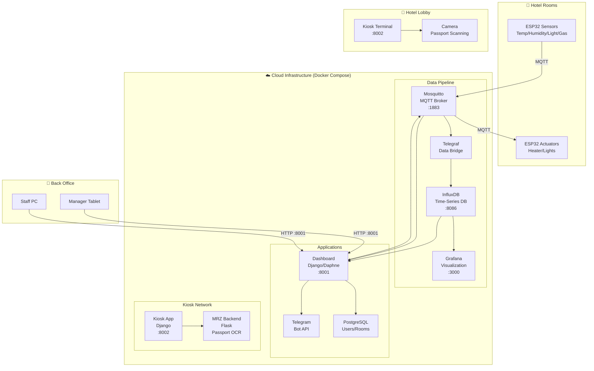

# Smart Hotel


> A comprehensive IoT-powered smart hotel management system featuring real-time sensor monitoring, self-service guest check-in, passport scanning with MRZ extraction, and complete cloud infrastructure for deployment.

## Table of Contents

- [Overview](#overview)
- [System Architecture](#system-architecture)
- [Components](#components)
- [Quick Start](#quick-start)
- [Screenshots](#screenshots)
- [Documentation](#documentation)
- [Hardware](#hardware)
- [Development](#development)
- [License](#license)

## Overview

Smart Hotel is a full-stack IoT solution for modern hotel management. The system connects ESP32-based sensors and actuators to a cloud backend, providing staff with real-time monitoring dashboards and guests with a self-service check-in experience.

### Key Features

| Feature | Description |
|---------|-------------|
| **Real-time Monitoring** | Temperature, humidity, luminosity, and gas sensors per room |
| **Climate Control** | Remote temperature and lighting management |
| **Self Check-in Kiosk** | Passport scanning with MRZ extraction |
| **Multi-language Support** | EN, DE, PL, UK, RU for international guests |
| **Role-based Access** | Admin, Monitor, and Guest permission levels |
| **Telegram Notifications** | Guest credential delivery |
| **Historical Analytics** | Time-series data visualization with Grafana |

## System Architecture



### Data Flow Summary

| Flow | Path | Protocol |
|------|------|----------|
| Sensor → Cloud | ESP32 → Mosquitto → Telegraf → InfluxDB | MQTT |
| Cloud → Actuator | Dashboard → Mosquitto → ESP32 | MQTT |
| Guest Check-in | Kiosk → MRZ Backend → Document | HTTP/REST |
| Staff Monitoring | Dashboard → PostgreSQL/InfluxDB | HTTP/WebSocket |
| Notifications | Dashboard → Telegram API | HTTPS |

## Components

| Component | Description | Documentation |
|-----------|-------------|---------------|
| **Cloud Infrastructure** | Docker Compose stack with all backend services | [cloud/README.md](cloud/README.md) |
| **Dashboard** | Django-based management interface | [dashboards/django_app/README.md](dashboards/django_app/README.md) |
| **Guest Kiosk** | Self-service check-in system | [kiosk/README.md](kiosk/README.md) |
| **MRZ Automation** | Passport scanning and OCR | [kiosk/app/README.md](kiosk/app/README.md) |
| **ESP32 Firmware** | Sensor and actuator code | [esp32/README.md](esp32/README.md) |
| **ESP32-CAM** | Camera module for facial recognition | [esp32-cam/README.md](esp32-cam/README.md) |
| **Hardware** | PCB designs and schematics | [hardware/README.md](hardware/README.md) |

## Quick Start

### Prerequisites

- Docker Engine 20.10+
- Docker Compose 2.0+
- 8GB+ RAM recommended
- USB camera (for kiosk passport scanning)

### One-Command Deployment

```bash
# Clone the repository
git clone https://github.com/yourusername/smart-hotel.git
cd smart-hotel/cloud

# Start all services
docker compose up --build -d

# Check status
docker compose ps
```

### Access Points

| Service | URL | Credentials |
|---------|-----|-------------|
| **Staff Dashboard** | http://localhost:8001 | `admin` / `admin123` |
| **Guest Kiosk** | http://localhost:8002 | (no auth) |
| **Grafana** | http://localhost:3000 | `admin` / `admin` |
| **InfluxDB** | http://localhost:8086 | `admin` / `adminpass` |

### Development Mode

For development with additional debugging features:

```bash
docker compose -f docker-compose.yml -f docker-compose-dev.yml up --build -d
```

This exposes:
- MRZ Test Frontend at http://localhost:5000
- Django/Flask debug modes enabled
- Hot reload for code changes

## Screenshots

### Admin Dashboard

*Full room overview with real-time sensor data and control options*

### Guest Management

*Generate temporary guest accounts and manage access*

### Monitor View

*View-only access for monitoring staff*

### Guest Dashboard

*Limited access for guests to control their assigned room*

### Login Page

*Secure role-based authentication*

## Documentation

Detailed documentation for each component:

### Cloud Infrastructure
Complete Docker Compose orchestration with InfluxDB, Grafana, Mosquitto, PostgreSQL, and all application services.

📖 **[Cloud Documentation](cloud/README.md)** - Architecture, configuration, networking, volumes, troubleshooting

### Staff Dashboard
Django-based management interface with real-time WebSocket updates, MQTT integration, and role-based access control.

📖 **[Dashboard Documentation](dashboards/django_app/README.md)** - Features, API reference, WebSocket endpoints, deployment

### Guest Kiosk
Self-service check-in system with passport scanning, multi-language support, and document generation.

📖 **[Kiosk Documentation](kiosk/README.md)** - Guest flow, i18n, theming, MRZ integration

### MRZ Automation AI
Production-ready passport scanning with layered architecture for capture, correction, extraction, and document filling.

📖 **[MRZ Documentation](kiosk/app/README.md)** - Pipeline architecture, API, configuration, debugging

## Hardware

### ESP32 Sensor Node

The sensor nodes use ESP32-S modules with:
- DHT22 temperature/humidity sensor
- BH1750 luminosity sensor
- MQ-2 gas sensor
- WiFi connectivity for MQTT

PCB designs available in the [hardware/ESP-32S PCB](hardware/ESP-32S%20PCB) directory with Gerber files for manufacturing.

### ESP32-CAM Module

Used for:
- Passport scanning at kiosk
- Optional facial recognition enrollment

## Development

### Local Development Setup

```bash
# Dashboard development
cd dashboards/django_app
python -m venv venv && source venv/bin/activate
pip install -r requirements.txt
python manage.py migrate
python manage.py init_data
daphne -b 0.0.0.0 -p 8000 smart_hotel.asgi:application

# Kiosk development
cd kiosk
python -m venv venv && source venv/bin/activate
pip install -r requirements.txt
python manage.py migrate
python manage.py runserver 0.0.0.0:8002

# MRZ Backend development
cd kiosk/app
python -m venv venv && source venv/bin/activate
pip install -r requirements.txt
python app.py
```

### Project Structure

```
smart-hotel/
├── README.md                 # This file
├── Dockerfile                # Base container image
├── cloud/                    # Docker Compose infrastructure
│   ├── docker-compose.yml    # Production stack
│   ├── docker-compose-dev.yml# Development overrides
│   └── config/               # Service configurations
├── dashboards/               # Staff management interface
│   └── django_app/           # Django application
├── kiosk/                    # Guest self check-in
│   ├── kiosk/                # Django kiosk app
│   └── app/                  # MRZ Flask backend
├── esp32/                    # Sensor firmware
├── esp32-cam/                # Camera firmware
└── hardware/                 # PCB designs
```

## License

This project is licensed under the MIT License - see the [LICENSE](LICENSE) file for details.

