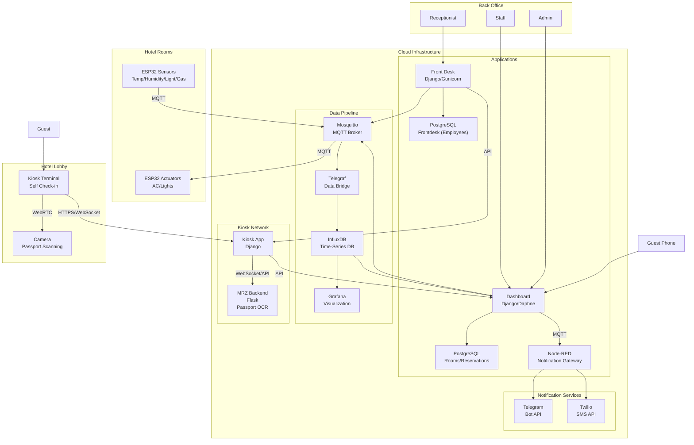
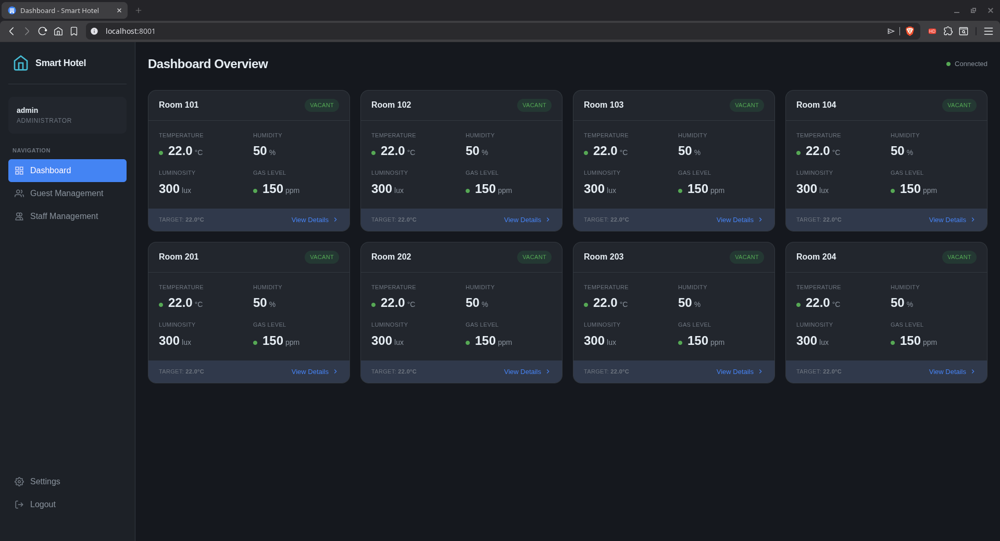
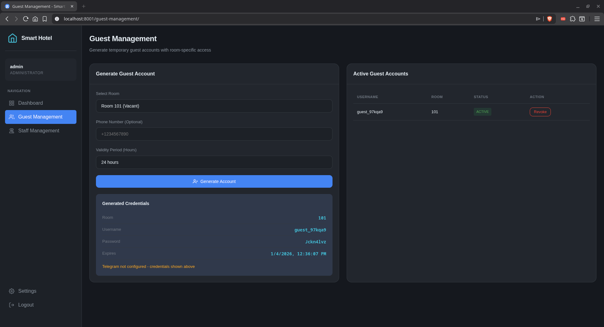
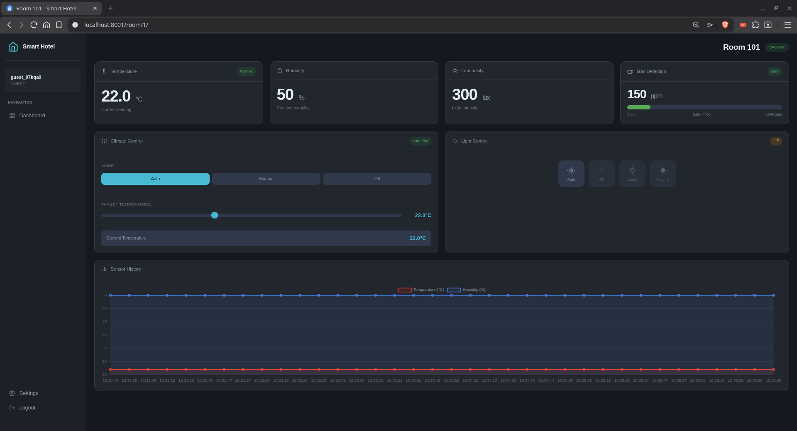
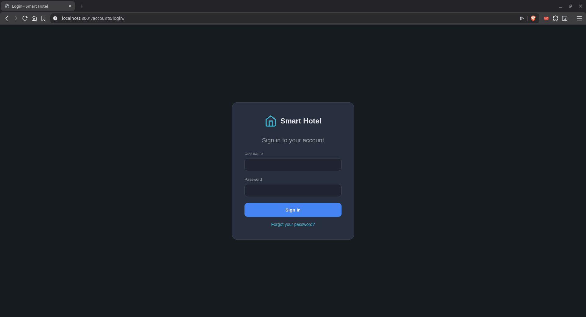

# Smart Hotel


> A comprehensive IoT-powered smart hotel management system featuring real-time sensor monitoring, self-service guest check-in, passport scanning with MRZ extraction, and complete cloud infrastructure for deployment.

## Table of Contents

- [Overview](#overview)
- [System Architecture](#system-architecture)
- [Components](#components)
- [Quick Start](#quick-start)
- [Screenshots](#screenshots)
- [Documentation](#documentation)
- [Hardware](#hardware)
- [Development](#development)
- [License](#license)

## Overview

Smart Hotel is a full-stack IoT solution for modern hotel management. The system connects ESP32-based sensors and actuators to a cloud backend, providing staff with real-time monitoring dashboards and guests with a self-service check-in experience.

### Key Features

| Feature | Description |
| -------- | ------------- |
| **Real-time Monitoring** | Temperature, humidity, luminosity, and gas sensors per room |
| **Climate Control** | Remote temperature and lighting management |
| **Self Check-in Kiosk** | Passport scanning with MRZ extraction |
| **Front Desk System** | Employee management, reservations, document access |
| **Multi-language Support** | EN, DE, PL, UK, RU for international guests |
| **User Authentication** | Django-based authentication with PostgreSQL |
| **Role-based Access** | Admin, Monitor, Guest, and Employee permission levels |
| **SMS Notifications** | Guest credential delivery via Node-RED (Twilio) |
| **Telegram Alerts** | Admin notifications with automatic fallback |
| **Unified Notifications** | Telegram → SMS fallback with admin alerts |
| **Historical Analytics** | Time-series data visualization with Grafana |

## System Architecture



### Data Flow Summary

| Flow | Path | Protocol |
| ------ | ------ | ---------- |
| Sensor → Cloud | ESP32 → Mosquitto → Telegraf → InfluxDB | MQTT |
| Cloud → Actuator | Dashboard → Mosquitto → ESP32 | MQTT |
| User Authentication | Browser → Dashboard (Django) | HTTP |
| Guest Check-in | Kiosk → MRZ Backend → Document | WebSocket (24fps) / HTTP |
| Staff Monitoring | Dashboard → PostgreSQL/InfluxDB | HTTP/WebSocket |
| SMS Notifications | Dashboard → MQTT → Node-RED → Twilio | MQTT/HTTPS |
| Telegram Alerts | Dashboard → MQTT → Node-RED → Telegram | MQTT/HTTPS |

## Components

| Component | Description | Status | Documentation |
| ----------- | ------------- | -------- | --------------- |
| **Cloud Infrastructure** | Docker Compose stack with all backend services | Production | [cloud/README.md](cloud/README.md) |
| **Dashboard** | Django-based guest monitoring interface | Production | [dashboards/README.md](dashboards/README.md) |
| **Front Desk** | Employee reservation & document management | Production | [frontdesk/README.md](frontdesk/README.md) |
| **Guest Kiosk** | Self-service check-in with WebSocket streaming | Production | [kiosk/README.md](kiosk/README.md) |
| **MRZ Backend** | Passport OCR microservice (24fps WebSocket) | v3.3.0 | [kiosk/app/README.md](kiosk/app/README.md) |
| **ESP32 Firmware** | Sensor and actuator RTOS firmware | Production | [esp32/README.md](esp32/README.md) |
| **ESP32-CAM** | Face recognition with TensorFlow Lite & MQTT | Production | [esp32-cam/README.md](esp32-cam/README.md) |
| **Hardware** | PCB designs and schematics | Complete | [hardware/README.md](hardware/README.md) |

## Quick Start

### Prerequisites

- Docker Engine 20.10+
- Docker Compose 2.0+
- 8GB+ RAM recommended
- USB camera (for kiosk passport scanning)

### One-Command Deployment

```bash
# Clone the repository
git clone https://github.com/yourusername/smart-hotel.git
cd smart-hotel/cloud

# Run the interactive setup wizard
./setup.sh

# Start all services
docker compose up --build -d

# Check status
docker compose ps
```

The setup wizard will:

- Detect and resolve port conflicts (remap to available ports)
- Configure external URLs for your server
- Set up optional MQTT authentication and TLS
- Generate all required secrets automatically

### Initial Setup

After starting, all core services are pre-configured:

- **Dashboard**: Admin user created (admin/SmartHotel2026!)
- **InfluxDB**: Pre-configured with sensor buckets and retention policies
- **Grafana**: Connected to InfluxDB with default dashboards

### Default Credentials

| Service | Username | Password |
| -------- | ---------- | ---------- |
| **Dashboard Admin** | `admin` | `SmartHotel2026!` |
| **Grafana** | `admin` | See `.env` |
| **InfluxDB** | `admin` | See `.env` |

> **Security:** Change the admin password in production!

### Access Points

| Service | URL | Credentials |
| -------- | ----- | ------------- |
| **Staff Dashboard** | <http://localhost:8001> | admin / SmartHotel2026! |
| **Guest Kiosk** | <http://localhost:8002> | (no auth) |
| **Front Desk** | <http://localhost:8003> | admin / see .env |
| **Grafana** | <http://localhost:3000> | From `.env` |
| **InfluxDB** | <http://localhost:8086> | From `.env` |
| **Node-RED** | <http://localhost:1880/api/health> | Headless (no UI) |

### Development Mode

For development with additional debugging features:

```bash
docker compose -f docker-compose.yml -f docker-compose-dev.yml up --build -d
```

This exposes:

- MRZ Test Frontend at <http://localhost:5000>
- Django/Flask debug modes enabled
- Hot reload for code changes

## Screenshots

### Admin Dashboard


*Full room overview with real-time sensor data and control options*

### Guest Management


*Generate temporary guest accounts and manage access*

### Monitor View


*View-only access for monitoring staff*

### Guest Dashboard


*Limited access for guests to control their assigned room*

### Login Page


*Secure role-based authentication*

## Documentation

Detailed documentation for each component:

### Cloud Infrastructure

Complete Docker Compose orchestration with InfluxDB, Grafana, Mosquitto, PostgreSQL, and all application services.

**[Cloud Documentation](cloud/README.md)** - Architecture, configuration, networking, volumes, troubleshooting

### Staff Dashboard

Django-based management interface with real-time WebSocket updates, MQTT integration, and role-based access control.

**[Dashboard Documentation](dashboards/django_app/README.md)** - Features, API reference, WebSocket endpoints, deployment

### Guest Kiosk

Self-service check-in system with passport scanning, multi-language support, and document generation.

**[Kiosk Documentation](kiosk/README.md)** - Guest flow, i18n, theming, MRZ integration

### Front Desk

Employee management system for front desk staff with reservation management, document access, and kiosk integration.

**[Front Desk Documentation](frontdesk/README.md)** - Employee roles, reservation workflow, kiosk sync

### MRZ Automation AI

Production-ready passport scanning with layered architecture for capture, correction, extraction, and document filling.

**[MRZ Documentation](kiosk/app/README.md)** - Pipeline architecture, API, configuration, debugging

### ESP32-CAM AI Pipeline

End-to-end facial recognition pipeline: model training, quantization, deployment, and ESP32-CAM firmware integration.

**[ESP32-CAM AI Pipeline](esp32-cam/AI/README.md)** - Model training, quantization, deployment, and technical deep dive

## Hardware

### ESP32 Sensor Node

The sensor nodes use ESP32-S modules running FreeRTOS firmware with:

| Sensor | Model | Function |
| -------- | ------- | ---------- |
| **Temperature/Humidity** | DHT22 | Climate monitoring |
| **Luminosity** | LDR (photoresistor) | Ambient light detection |
| **Gas Detection** | MQ-5 | Combustible gas monitoring |

**Features:**

- Real-time MQTT publishing to cloud backend
- Remote control via MQTT subscriptions
- Automatic WiFi reconnection
- FreeRTOS task-based architecture
- Configurable sensor polling rates

**[ESP32 Firmware Documentation](esp32/README.md)** - Pin configuration, MQTT topics, build instructions

PCB designs available in the [hardware/ESP-32S PCB](hardware/ESP-32S%20PCB) directory with Gerber files for manufacturing.

### ESP32-CAM Module

**Production Ready** - On-device face recognition with MQTT cloud integration.

Capabilities:

- **TensorFlow Lite Micro** for on-device inference (~80-100ms)
- **MobileNetV2** model (96x96 input, configurable classes)
- **Real-time MQTT publishing** of recognition events
- **VIP detection** with instant cloud notifications
- **Remote control** via MQTT commands

**[ESP32-CAM Documentation](esp32-cam/README.md)** - Hardware, MQTT topics, firmware setup

**[ESP32-CAM AI Pipeline](esp32-cam/AI/README.md)** - Full AI pipeline: model training, quantization, deployment

## Development

### Local Development Setup

```bash
# Dashboard development
cd dashboards/django_app
python -m venv venv && source venv/bin/activate
pip install -r requirements.txt
python manage.py migrate
python manage.py init_data
daphne -b 0.0.0.0 -p 8000 smart_hotel.asgi:application

# Kiosk development
cd kiosk
python -m venv venv && source venv/bin/activate
pip install -r requirements.txt
python manage.py migrate
python manage.py runserver 0.0.0.0:8002

# MRZ Backend development
cd kiosk/app
python -m venv venv && source venv/bin/activate
pip install -r requirements.txt
python app.py
```

### Project Structure

```text
smart-hotel/
├── README.md                 # This file
├── Dockerfile                # Base container image
├── cloud/                    # Docker Compose infrastructure
│   ├── docker-compose.yml    # Production stack
│   ├── docker-compose-dev.yml# Development overrides
│   └── config/               # Service configurations
├── dashboards/               # Guest room monitoring interface
│   └── django_app/           # Django application
├── frontdesk/                # Front desk employee system
│   ├── employees/            # Employee auth & management
│   ├── reservations/         # Reservation management
│   └── documents/            # Document access from kiosk
├── kiosk/                    # Guest self check-in
│   ├── kiosk/                # Django kiosk app
│   └── app/                  # MRZ Flask backend
├── esp32/                    # Sensor firmware
├── esp32-cam/                # Camera firmware
└── hardware/                 # PCB designs
```

## License

This project is licensed under the MIT License - see the [LICENSE](LICENSE) file for details.
