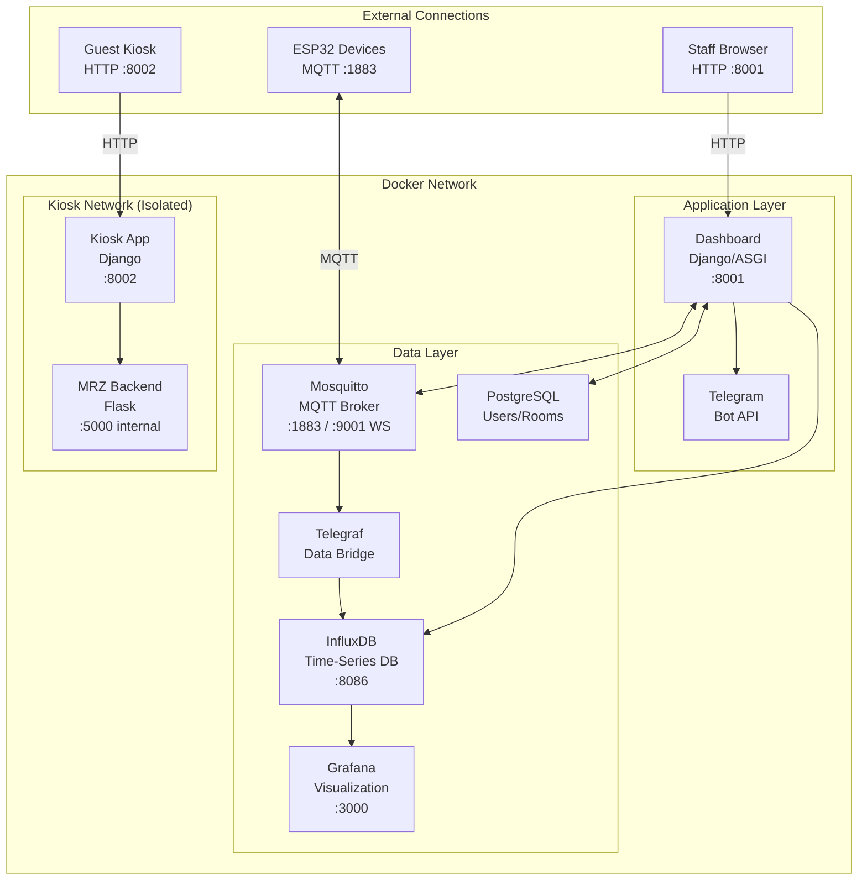
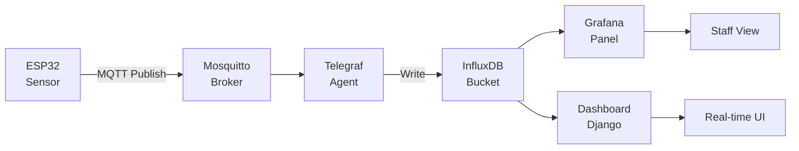
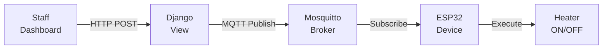

# Smart Hotel Cloud Infrastructure


> Complete containerized infrastructure stack for the Smart Hotel system, featuring time-series data storage, MQTT messaging, real-time dashboards, and microservice orchestration.

## Table of Contents

- [Overview](#overview)
- [Architecture](#architecture)
- [Services](#services)
- [Quick Start](#quick-start)
- [Configuration](#configuration)
- [Network Topology](#network-topology)
- [Data Persistence](#data-persistence)
- [Monitoring & Observability](#monitoring--observability)
- [Development Mode](#development-mode)
- [Troubleshooting](#troubleshooting)

## Overview

The Smart Hotel cloud infrastructure provides all backend services required to run the hotel management system. Using Docker Compose, it orchestrates multiple containers that work together to:

- **Collect sensor data** from ESP32 devices via MQTT
- **Store time-series data** in InfluxDB for historical analysis
- **Visualize metrics** through Grafana dashboards
- **Bridge MQTT to InfluxDB** via Telegraf
- **Serve web applications** for staff (Dashboard) and guests (Kiosk)
- **Process passport images** via the MRZ microservice

## Architecture



### Data Flow Diagrams

#### Sensor Data Flow



#### Control Command Flow



## Services

### Core Infrastructure

| Service | Image | Port | Description |
|---------|-------|------|-------------|
| **InfluxDB** | `influxdb:2-alpine` | 8086 | Time-series database for sensor data |
| **PostgreSQL** | `postgres:16-alpine` | 5432 (internal) | Relational database for users/rooms |
| **Mosquitto** | `eclipse-mosquitto:latest` | 1883, 9001 | MQTT broker for IoT messaging |
| **Telegraf** | `telegraf:alpine` | - | MQTT → InfluxDB data bridge |
| **Grafana** | `grafana/grafana:latest` | 3000 | Metrics visualization |

### Application Services

| Service | Build Context | Port | Description |
|---------|---------------|------|-------------|
| **Dashboard** | `../dashboards/django_app` | 8001 | Staff management interface |
| **Kiosk** | `../kiosk` | 8002 | Guest self check-in |
| **MRZ Backend** | `../kiosk/app` | 5000 (dev only) | Passport processing API |

## Quick Start

### Prerequisites

- Docker Engine 20.10+
- Docker Compose 2.0+
- 4GB+ available RAM
- Ports 3000, 8001, 8002, 8086, 1883 available

### Production Deployment

```bash
# Clone the repository
git clone https://github.com/yourusername/smart-hotel.git
cd smart-hotel/cloud

# Start all services
docker compose up --build -d

# Check service status
docker compose ps

# View logs
docker compose logs -f
```

### Development Mode

Development mode exposes additional debugging features:

```bash
# Start with development overrides
docker compose -f docker-compose.yml -f docker-compose-dev.yml up --build -d
```

**Development features:**
- MRZ Test Frontend exposed at port 5000
- Flask debug mode with auto-reload
- Django debug mode enabled
- Verbose logging

### Stopping Services

```bash
# Stop all services (preserves data)
docker compose down

# Stop and remove volumes (⚠️ deletes all data)
docker compose down -v
```

## Configuration

### Service Endpoints

| Service | URL | Credentials |
|---------|-----|-------------|
| Grafana | http://localhost:3000 | `admin` / `admin` |
| InfluxDB | http://localhost:8086 | `admin` / `adminpass` |
| Dashboard | http://localhost:8001 | `admin` / `admin123` |
| Kiosk | http://localhost:8002 | (no auth for guests) |
| Mosquitto | mqtt://localhost:1883 | (no auth by default) |

### Environment Variables

#### InfluxDB

| Variable | Value | Description |
|----------|-------|-------------|
| `DOCKER_INFLUXDB_INIT_USERNAME` | `admin` | Admin username |
| `DOCKER_INFLUXDB_INIT_PASSWORD` | `adminpass` | Admin password |
| `DOCKER_INFLUXDB_INIT_ORG` | `org` | Organization name |
| `DOCKER_INFLUXDB_INIT_BUCKET` | `bucket` | Default bucket |
| `DOCKER_INFLUXDB_INIT_ADMIN_TOKEN` | `admin-token` | API token |

#### Dashboard

| Variable | Value | Description |
|----------|-------|-------------|
| `DJANGO_SECRET_KEY` | (set unique) | Django secret key |
| `DJANGO_DEBUG` | `True`/`False` | Debug mode |
| `MQTT_BROKER` | `mosquitto` | MQTT hostname |
| `MQTT_PORT` | `1883` | MQTT port |
| `INFLUX_URL` | `http://influxdb:8086` | InfluxDB URL |
| `TELEGRAM_BOT_TOKEN` | (optional) | Telegram bot token |
| `TELEGRAM_CHAT_ID` | (optional) | Telegram chat ID |

#### PostgreSQL

| Variable | Value | Description |
|----------|-------|-------------|
| `POSTGRES_DB` | `smarthotel` | Database name |
| `POSTGRES_USER` | `smarthotel` | Database user |
| `POSTGRES_PASSWORD` | `smarthotel` | Database password |

### Configuration Files

```
config/
├── grafana/
│   └── provisioning/        # Grafana datasources and dashboards
├── influxdb/
│   ├── config.yml           # InfluxDB configuration
│   └── init-telegraf.sh     # Telegraf user initialization
├── mosquitto/
│   └── mosquitto.conf       # MQTT broker settings
└── telegraf/
    └── telegraf.conf        # MQTT→InfluxDB bridge config
```

## Network Topology

### Docker Networks

The compose file creates two isolated networks:

```
┌─────────────────────────────────────┐
│           default network           │
│                                     │
│  influxdb ← telegraf ← mosquitto    │
│      ↓          ↑                   │
│   grafana    dashboard              │
│                ↓                    │
│            postgres                 │
└─────────────────────────────────────┘

┌─────────────────────────────────────┐
│          kiosk-network              │
│                                     │
│      kiosk ──→ mrz-backend          │
│                                     │
└─────────────────────────────────────┘
```

### Port Mappings

| Host Port | Container | Service |
|-----------|-----------|---------|
| 3000 | 3000 | Grafana web UI |
| 8086 | 8086 | InfluxDB API |
| 8001 | 8000 | Dashboard Django |
| 8002 | 8000 | Kiosk Django |
| 1883 | 1883 | MQTT TCP |
| 9001 | 9001 | MQTT WebSocket |
| 5000 (dev) | 5000 | MRZ test frontend |

## Data Persistence

### Named Volumes

All persistent data is stored in Docker named volumes:

| Volume | Service | Purpose |
|--------|---------|---------|
| `influxdb-data` | InfluxDB | Time-series data |
| `influxdb-config` | InfluxDB | Configuration |
| `grafana-data` | Grafana | Dashboards, users |
| `grafana-logs` | Grafana | Log files |
| `mosquitto-data` | Mosquitto | Retained messages |
| `mosquitto-logs` | Mosquitto | Broker logs |
| `postgres-data` | PostgreSQL | Users, rooms, history |
| `kiosk_data` | Kiosk | SQLite database |
| `kiosk_media` | Kiosk | Uploaded files |
| `mrz_logs` | MRZ Backend | Processed passports |

### Backup & Restore

```bash
# Backup InfluxDB data
docker compose exec influxdb influx backup /var/lib/influxdb2/backup

# Backup PostgreSQL
docker compose exec postgres pg_dump -U smarthotel smarthotel > backup.sql

# Restore PostgreSQL
docker compose exec -T postgres psql -U smarthotel smarthotel < backup.sql
```

## Monitoring & Observability

### Grafana Dashboards

Pre-configured dashboards for:
- **Room Sensors**: Temperature, humidity, luminosity per room
- **System Health**: Container metrics, network traffic
- **MQTT Traffic**: Message rates, topic activity

Access Grafana at http://localhost:3000

### InfluxDB Queries

Query sensor data directly:

```flux
from(bucket: "bucket")
  |> range(start: -1h)
  |> filter(fn: (r) => r._measurement == "mqtt_consumer")
  |> filter(fn: (r) => r.topic =~ /hotel\/room\/.*\/temperature/)
```

### Logs

```bash
# All services
docker compose logs -f

# Specific service
docker compose logs -f dashboard

# Last 100 lines
docker compose logs --tail=100 mosquitto
```

## Development Mode

### docker-compose-dev.yml

The development override file adds:

```yaml
services:
  mrz-backend:
    ports:
      - "5000:5000"  # Expose test frontend
    environment:
      FLASK_DEBUG: '1'
      
  dashboard:
    environment:
      DJANGO_DEBUG: 'True'
      
  kiosk:
    environment:
      DEBUG: '1'
```

### Hot Reload

For active development, mount source code:

```yaml
services:
  dashboard:
    volumes:
      - ../dashboards/django_app:/app
```

## Troubleshooting

### Common Issues

**Port already in use:**
```bash
# Find process using port
sudo lsof -i :3000
# Kill process or change port in docker-compose.yml
```

**Database connection failed:**
```bash
# Check if postgres is ready
docker compose logs postgres
# Restart dependent services
docker compose restart dashboard
```

**MQTT not receiving messages:**
```bash
# Test MQTT connectivity
docker compose exec mosquitto mosquitto_sub -t '#' -v
# Check Telegraf logs
docker compose logs telegraf
```

**InfluxDB token issues:**
```bash
# Recreate Telegraf user
docker compose exec influxdb /docker-entrypoint-initdb.d/init-telegraf.sh
```

### Health Checks

```bash
# Check all container status
docker compose ps

# Test InfluxDB
curl http://localhost:8086/health

# Test Mosquitto
mosquitto_pub -h localhost -t "test" -m "hello"

# Test Dashboard
curl http://localhost:8001/api/rooms/
```

### Rebuilding Services

```bash
# Rebuild single service
docker compose build dashboard
docker compose up -d dashboard

# Full rebuild with no cache
docker compose build --no-cache
docker compose up -d
```

## Security Notes

⚠️ **Production Checklist:**

1. **Change all default passwords** (Grafana, InfluxDB, PostgreSQL, Django)
2. **Set unique secret keys** for Django applications
3. **Enable MQTT authentication** in mosquitto.conf
4. **Use HTTPS** with proper certificates
5. **Restrict network access** to internal services only
6. **Enable firewall rules** for exposed ports
7. **Regular backups** of all volumes
