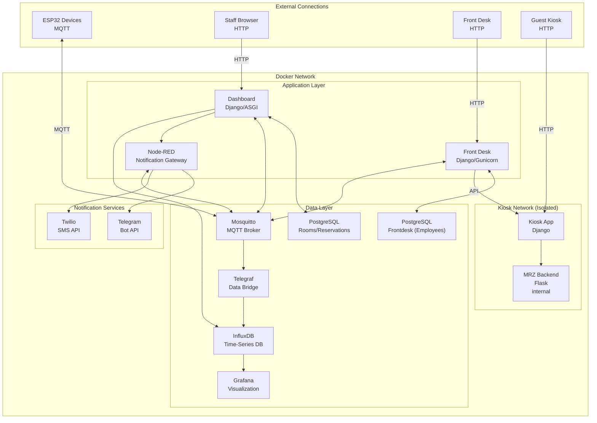
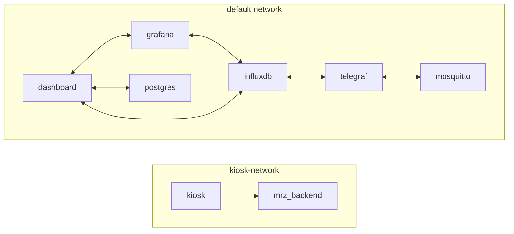

# Smart Hotel Cloud Infrastructure


> Complete containerized infrastructure stack for the Smart Hotel system, featuring time-series data storage, MQTT messaging, real-time dashboards, and microservice orchestration.

## Table of Contents

- [Overview](#overview)
- [Architecture](#architecture)
- [Services](#services)
- [Quick Start](#quick-start)
- [Configuration](#configuration)
- [Notification System](#notification-system)
- [Network Topology](#network-topology)
- [Data Persistence](#data-persistence)
- [Monitoring & Observability](#monitoring--observability)
- [Development Mode](#development-mode)
- [Troubleshooting](#troubleshooting)

## Overview

The Smart Hotel cloud infrastructure provides all backend services required to run the hotel management system. Using Docker Compose, it orchestrates multiple containers that work together to:

- **Collect sensor data** from ESP32 devices via MQTT
- **Store time-series data** in InfluxDB for historical analysis
- **Visualize metrics** through Grafana dashboards
- **Bridge MQTT to InfluxDB** via Telegraf
- **Serve web applications** for staff (Dashboard) and guests (Kiosk)
- **Process passport images** via the MRZ microservice

## Architecture



### Data Flow Diagrams

#### Sensor Data Flow


#### Control Command Flow


## Services

### Core Infrastructure

| Service | Image | Description |
| --------- | ------- | ------------- |
| **InfluxDB** | `influxdb:2-alpine` | Time-series database for sensor data |
| **PostgreSQL** | `postgres:16-alpine` | Relational database for rooms/reservations |
| **PostgreSQL (Frontdesk)** | `postgres:16-alpine` | Isolated database for employee credentials |
| **Mosquitto** | `eclipse-mosquitto:latest` | MQTT broker for IoT messaging |
| **Telegraf** | `telegraf:alpine` | MQTT → InfluxDB data bridge |
| **Grafana** | `grafana/grafana:latest` | Metrics visualization |

### Authentication & Messaging

| Service | Image | Port | Description |
| --------- | ------- | ------ | ------------- |
| **Node-RED** | `nodered/node-red:latest` | internal only | Notification gateway (Telegram + SMS) |

### Application Services

| Service | Build Context | Port | Description |
| --------- | --------------- | ------ | ------------- |
| **Dashboard** | `../dashboards/django_app` | 8001 | Staff management interface |
| **Kiosk** | `../kiosk` | 8002 | Guest self check-in (Django + Channels/Daphne) |
| **Front Desk** | `../frontdesk` | 8003 | Employee reservation management |
| **MRZ Backend** | `../kiosk/app` | 5000 (dev only) | Passport OCR API v3.3.0 (Flask + WebSocket) |

## Quick Start

### Prerequisites

- Docker Engine 20.10+
- Docker Compose 2.0+
- 4GB+ available RAM
- OpenSSL (for secret generation)

### Production Deployment

```bash
# Clone the repository
git clone https://github.com/yourusername/smart-hotel.git
cd smart-hotel/cloud

# Run the interactive setup wizard
./setup.sh

# Start all services
docker compose up --build -d

# Check service status
docker compose ps

# View logs
docker compose logs -f
```

### Setup Wizard Options

The `./setup.sh` script provides an interactive wizard to configure:

| Feature | Description |
| --------- | ------------- |
| **Port Conflict Detection** | Automatically scans for port conflicts and offers remapping |
| **MQTT Authentication** | Optional username/password authentication for MQTT broker |
| **MQTT TLS** | Optional TLS encryption with self-signed or custom certificates |
| **External URL** | Configure domain for production deployment |

#### Port Conflict Resolution

The setup wizard automatically detects if any required ports are in use and offers three options:

1. **Remap** - Use a different port (e.g., 9443 → 9444)
2. **Disable** - Skip the port binding for that service
3. **Keep** - Use the default port anyway (may fail at startup)

Remapped ports are automatically saved to `.env` and displayed in the summary.

All core services (InfluxDB, Grafana, Dashboard) are **pre-configured automatically** via:

- InfluxDB initialization scripts (create buckets, retention policies, and Telegraf configs)
- Grafana provisioning (datasources and default dashboards)
- Dashboard admin user created automatically

### Updating the Stack

Use the update script for safe updates with automatic backups:

```bash
./update.sh
```

The update script will:

1. Create backups of PostgreSQL and InfluxDB databases
2. Pull latest Docker images
3. Run database migrations
4. Perform health checks

### Development Deployment

Development mode exposes additional debugging features:

```bash
# Start with development overrides
docker compose -f docker-compose.yml -f docker-compose-dev.yml up --build -d
```

**Development features:**

- MRZ Test Frontend exposed at port 5000
- Flask debug mode with auto-reload
- Django debug mode enabled
- Verbose logging
- Kiosk uses Daphne ASGI for WebSocket support
- MRZ Backend uses gevent-websocket for WebSocket support

### Stopping Services

```bash
# Stop all services (preserves data)
docker compose down

# Stop and remove volumes (WARNING: deletes all data)
docker compose down -v
```

## Configuration

### Service Endpoints

All ports are configurable via `.env` - the setup wizard can remap ports if conflicts are detected.

| Service | Default URL | Notes |
| --------- | ------------- | ------- |
| Dashboard | <http://localhost:8001> | Login: admin / SmartHotel2026! |
| Grafana | <http://localhost:3000> | Credentials from `.env` |
| InfluxDB | <http://localhost:8086> | Credentials from `.env` |
| Kiosk | <http://localhost:8002> | No auth required for guests |
| Node-RED | Internal only | Headless - no external port exposed |
| Mosquitto | mqtt://localhost:1883 | Optional auth via setup.sh |
| Mosquitto TLS | mqtts://localhost:8883 | Optional, configure via setup.sh |
| Mosquitto WS | ws://localhost:9001 | WebSocket for browser clients |

### Reverse Proxy Configuration

For production deployment with custom domains, use a reverse proxy (nginx, Traefik, or Caddy). Below is a comprehensive nginx configuration for all Smart Hotel services:

#### Complete Nginx Configuration

```nginx
# /etc/nginx/conf.d/smart-hotel.conf
# Smart Hotel Reverse Proxy Configuration

# Upstream definitions
upstream dashboard {
    server 127.0.0.1:8001;
    keepalive 10;
}

upstream kiosk {
    server 127.0.0.1:8002;
    keepalive 10;
}

upstream grafana {
    server 127.0.0.1:3000;
    keepalive 10;
}

upstream influxdb {
    server 127.0.0.1:8086;
    keepalive 10;
}

# Staff Dashboard
server {
    listen 443 ssl http2;
    server_name dashboard.yourdomain.com;
    
    ssl_certificate /etc/nginx/ssl/yourdomain.com.crt;
    ssl_certificate_key /etc/nginx/ssl/yourdomain.com.key;
    
    location / {
        proxy_pass http://dashboard;
        proxy_http_version 1.1;
        proxy_set_header Host $host;
        proxy_set_header X-Real-IP $remote_addr;
        proxy_set_header X-Forwarded-For $proxy_add_x_forwarded_for;
        proxy_set_header X-Forwarded-Proto $scheme;
        
        # WebSocket support for real-time updates
        proxy_set_header Upgrade $http_upgrade;
        proxy_set_header Connection "upgrade";
        proxy_read_timeout 86400;
    }
    
    # Static files
    location /static/ {
        proxy_pass http://dashboard;
        proxy_cache_valid 200 1d;
    }
}

# Guest Kiosk (Public - No authentication required)
server {
    listen 443 ssl http2;
    server_name kiosk.yourdomain.com;
    
    ssl_certificate /etc/nginx/ssl/yourdomain.com.crt;
    ssl_certificate_key /etc/nginx/ssl/yourdomain.com.key;
    
    # Larger body size for passport image uploads
    client_max_body_size 10M;
    
    location / {
        proxy_pass http://kiosk;
        proxy_http_version 1.1;
        proxy_set_header Host $host;
        proxy_set_header X-Real-IP $remote_addr;
        proxy_set_header X-Forwarded-For $proxy_add_x_forwarded_for;
        proxy_set_header X-Forwarded-Proto $scheme;
        
        # Longer timeouts for MRZ processing
        proxy_read_timeout 120s;
        proxy_connect_timeout 60s;
    }
    
    # Media files (passport scans, signatures)
    location /media/ {
        proxy_pass http://kiosk;
        proxy_cache_valid 200 1h;
    }
}

# Grafana Dashboards
server {
    listen 443 ssl http2;
    server_name grafana.yourdomain.com;
    
    ssl_certificate /etc/nginx/ssl/yourdomain.com.crt;
    ssl_certificate_key /etc/nginx/ssl/yourdomain.com.key;
    
    location / {
        proxy_pass http://grafana;
        proxy_http_version 1.1;
        proxy_set_header Host $host;
        proxy_set_header X-Real-IP $remote_addr;
        proxy_set_header X-Forwarded-For $proxy_add_x_forwarded_for;
        proxy_set_header X-Forwarded-Proto $scheme;
        
        # WebSocket support for live dashboards
        proxy_set_header Upgrade $http_upgrade;
        proxy_set_header Connection "upgrade";
    }
    
    # Grafana API
    location /api/ {
        proxy_pass http://grafana;
        proxy_http_version 1.1;
        proxy_set_header Host $host;
        proxy_set_header X-Real-IP $remote_addr;
        proxy_set_header X-Forwarded-For $proxy_add_x_forwarded_for;
        proxy_set_header X-Forwarded-Proto $scheme;
    }
}

# InfluxDB API (Optional - for external data access)
server {
    listen 443 ssl http2;
    server_name influxdb.yourdomain.com;
    
    ssl_certificate /etc/nginx/ssl/yourdomain.com.crt;
    ssl_certificate_key /etc/nginx/ssl/yourdomain.com.key;
    
    # Restrict to internal/trusted IPs
    # allow 10.0.0.0/8;
    # deny all;
    
    location / {
        proxy_pass http://influxdb;
        proxy_http_version 1.1;
        proxy_set_header Host $host;
        proxy_set_header X-Real-IP $remote_addr;
        proxy_set_header X-Forwarded-For $proxy_add_x_forwarded_for;
        proxy_set_header X-Forwarded-Proto $scheme;
    }
}

# HTTP to HTTPS redirect for all domains
server {
    listen 80;
    server_name dashboard.yourdomain.com kiosk.yourdomain.com grafana.yourdomain.com influxdb.yourdomain.com;
    return 301 https://$host$request_uri;
}
```

#### Single Domain with Path-Based Routing

Alternatively, you can host all services under a single domain with path-based routing:

```nginx
# Single domain configuration
server {
    listen 443 ssl http2;
    server_name hotel.yourdomain.com;
    
    ssl_certificate /etc/nginx/ssl/yourdomain.com.crt;
    ssl_certificate_key /etc/nginx/ssl/yourdomain.com.key;
    
    client_max_body_size 10M;
    
    # Staff Dashboard
    location /dashboard/ {
        proxy_pass http://127.0.0.1:8001/;
        proxy_http_version 1.1;
        proxy_set_header Host $host;
        proxy_set_header X-Real-IP $remote_addr;
        proxy_set_header X-Forwarded-For $proxy_add_x_forwarded_for;
        proxy_set_header X-Forwarded-Proto $scheme;
        proxy_set_header Upgrade $http_upgrade;
        proxy_set_header Connection "upgrade";
    }
    
    # Guest Kiosk
    location /kiosk/ {
        proxy_pass http://127.0.0.1:8002/;
        proxy_http_version 1.1;
        proxy_set_header Host $host;
        proxy_set_header X-Real-IP $remote_addr;
        proxy_set_header X-Forwarded-For $proxy_add_x_forwarded_for;
        proxy_set_header X-Forwarded-Proto $scheme;
        proxy_read_timeout 120s;
    }
    
    # Grafana
    location /grafana/ {
        proxy_pass http://127.0.0.1:3000/;
        proxy_http_version 1.1;
        proxy_set_header Host $host;
        proxy_set_header X-Real-IP $remote_addr;
        proxy_set_header X-Forwarded-For $proxy_add_x_forwarded_for;
        proxy_set_header X-Forwarded-Proto $scheme;
        proxy_set_header Upgrade $http_upgrade;
        proxy_set_header Connection "upgrade";
    }
    
    # Default: redirect to dashboard
    location / {
        return 302 /dashboard/;
    }
}
```

#### Traefik Configuration (Docker Labels)

If using Traefik as your reverse proxy, add these labels to `docker-compose.yml`:

```yaml
services:
  dashboard:
    labels:
      - "traefik.enable=true"
      - "traefik.http.routers.dashboard.rule=Host(`dashboard.yourdomain.com`)"
      - "traefik.http.routers.dashboard.tls=true"
      - "traefik.http.services.dashboard.loadbalancer.server.port=8001"
  
  kiosk:
    labels:
      - "traefik.enable=true"
      - "traefik.http.routers.kiosk.rule=Host(`kiosk.yourdomain.com`)"
      - "traefik.http.routers.kiosk.tls=true"
      - "traefik.http.services.kiosk.loadbalancer.server.port=8002"
  
  grafana:
    labels:
      - "traefik.enable=true"
      - "traefik.http.routers.grafana.rule=Host(`grafana.yourdomain.com`)"
      - "traefik.http.routers.grafana.tls=true"
      - "traefik.http.services.grafana.loadbalancer.server.port=3000"
```

### MQTT Security (Optional)

The setup wizard can configure MQTT security:

#### Password Authentication

```bash
# Configured via setup.sh or manually:
docker exec mosquitto mosquitto_passwd -c /mosquitto/config/passwd mqtt_user
```

When enabled, all MQTT clients (ESP32 devices, Telegraf, Dashboard) must authenticate.

#### TLS Encryption

```bash
# Generate self-signed certificates (done automatically by setup.sh):
openssl req -x509 -nodes -days 3650 -newkey rsa:2048 \
  -keyout config/mosquitto/certs/server.key \
  -out config/mosquitto/certs/server.crt
```

TLS port 8883 is enabled when certificates are present.

### Environment Variables

All configuration is managed via the `.env` file. Run `./generate-env.sh` to create one with secure random secrets.

See `.env.example` for complete documentation of all variables.

#### Key Configuration Categories

| Category | Variables | Description |
| ---------- | ----------- | ------------- |
| **Database** | `POSTGRES_*` | Main PostgreSQL settings |
| **InfluxDB** | `INFLUX_*` | Time-series database |
| **Grafana** | `GRAFANA_*` | Visualization dashboard |
| **MQTT** | `MQTT_*` | Optional auth and TLS settings |
| **Node-RED** | `NODERED_*`, `TWILIO_*` | SMS gateway |
| **Telegram** | `TELEGRAM_*` | Bot notifications |
| **Kiosk** | `KIOSK_*` | Guest registration terminal |
| **Sessions** | `SESSION_COOKIE_AGE` | 7 days default for guests |

#### External Services (Manual Configuration)

| Service | How to Get Credentials |
| --------- | ------------------------ |
| **Twilio** | <https://console.twilio.com/> |
| **Telegram** | Create bot via @BotFather |
| **SMTP** | Your email provider |

### Configuration Files

```text
cloud/
├── .env                     # Environment variables (generate with ./generate-env.sh)
├── .env.example             # Template with documentation
├── generate-env.sh          # Script to generate secure .env
├── setup.sh                 # Interactive setup wizard (MQTT, TLS, etc.)
├── update.sh                # Safe update script with backups
├── docker-compose.yml       # Main compose file
├── docker-compose-dev.yml   # Development overrides
└── config/
    ├── grafana/
    │   └── provisioning/    # Grafana datasources and dashboards
    ├── influxdb/
    │   ├── config.yml       # InfluxDB configuration
    │   └── init-telegraf.sh # Bucket creation and Telegraf setup
    ├── mosquitto/
    │   ├── mosquitto.conf   # MQTT broker settings
    │   ├── passwd           # Password file (if auth enabled)
    │   └── certs/           # TLS certificates (if TLS enabled)
    ├── nodered/
    │   ├── settings.js      # Node-RED headless config
    │   └── flows.json       # Notification gateway flows
    └── telegraf/
        └── telegraf.conf    # MQTT→InfluxDB bridge config
```

## Notification System

The notification system uses Node-RED as a unified gateway for Telegram and SMS notifications with automatic fallback logic.

### Notification Architecture


### Notification Flow

1. Dashboard publishes notification to MQTT topic `hotel/notifications/send`
2. Node-RED receives notification and checks configured services
3. **If Telegram configured**: Try Telegram first
4. **If Telegram fails or not configured**: Try SMS
5. **If both fail**: Publish failure to `hotel/notifications/failure`
6. Results published to `hotel/notifications/result`

### Service Configuration

Set up notification services in `.env`:

```bash
# Telegram Bot (optional)
TELEGRAM_BOT_TOKEN=123456789:ABCdefGHIjklMNOpqrSTUvwxYZ
TELEGRAM_CHAT_ID=123456789

# Twilio SMS (optional)
TWILIO_ACCOUNT_SID=ACxxxxxxxxx
TWILIO_AUTH_TOKEN=xxxxxxxxx
TWILIO_PHONE_NUMBER=+1234567890
```

### API Endpoints

| Endpoint | Method | Description |
| ---------- | -------- | ------------- |
| `/api/health` | GET | Service health and configuration status |
| `/api/status` | GET | Detailed statistics |
| `/api/notify` | POST | Send notification (HTTP alternative) |

### MQTT Topics

| Topic | Direction | Payload |
| ------- | ----------- | --------- |
| `hotel/notifications/send` | IN | `{type, message, recipient, priority}` |
| `hotel/notifications/result` | OUT | `{id, success, method, attempts}` |
| `hotel/notifications/failure` | OUT | `{id, reason, attempts}` |
| `hotel/alerts/#` | IN | System alerts (gas, temperature, etc.) |

#### ESP32-CAM Topics (Face Recognition)

| Topic | Direction | Payload |
| ------- | ----------- | --------- |
| `hotel/kiosk/+/face/recognized` | IN | `{name, confidence, timestamp, device}` |
| `hotel/kiosk/+/face/unknown` | IN | `{confidence, timestamp, device}` |
| `hotel/kiosk/+/status` | IN | `{status, uptime, model_ready, free_heap}` |
| `hotel/kiosk/+/heartbeat` | IN | `{uptime, free_heap, wifi_rssi}` |
| `hotel/kiosk/<id>/control` | OUT | `{command: "status"\|"restart"\|"capture"}` |

### Notification Payload

```json
{
  "type": "guest_credentials",
  "message": "Welcome! WiFi: HotelGuest, Password: abc123",
  "recipient": {
    "phone": "+1234567890",
    "chat_id": "123456789"
  },
  "priority": "normal",
  "metadata": {
    "room": "101",
    "guest": "John Doe"
  }
}
```

### Dashboard Integration

The Notifications page (`/notifications/`) provides:

- Real-time service status
- Delivery statistics
- Send test notifications (admin only)
- View recent failures

## Network Topology

### Docker Networks

The compose file creates two isolated networks:



### Port Mappings

| Host Port | Container | Service |
| ----------- | ----------- | --------- |
| 3000 | 3000 | Grafana web UI |
| 8086 | 8086 | InfluxDB API |
| 8001 | 8000 | Dashboard Django |
| 8002 | 8000 | Kiosk Django |
| 1883 | 1883 | MQTT TCP |
| 9001 | 9001 | MQTT WebSocket |
| 5000 (dev) | 5000 | MRZ test frontend |

## Data Persistence

### Named Volumes

All persistent data is stored in Docker named volumes:

| Volume | Service | Purpose |
| -------- | --------- | --------- |
| `influxdb-data` | InfluxDB | Time-series data |
| `influxdb-config` | InfluxDB | Configuration |
| `grafana-logs` | Grafana | Log files |
| `mosquitto-data` | Mosquitto | Retained messages |
| `mosquitto-logs` | Mosquitto | Broker logs |
| `postgres-data` | PostgreSQL | Rooms, reservations |
| `postgres-frontdesk-data` | PostgreSQL | Employee credentials (isolated) |
| `nodered-data` | Node-RED | Flow data |
| `kiosk_data` | Kiosk | SQLite database |
| `kiosk_media` | Kiosk | Uploaded files |
| `mrz_logs` | MRZ Backend | Processed passports |

### Backup & Restore

```bash
# Backup InfluxDB data
docker compose exec influxdb influx backup /var/lib/influxdb2/backup

# Backup PostgreSQL
docker compose exec postgres pg_dump -U smarthotel smarthotel > backup.sql

# Restore PostgreSQL
docker compose exec -T postgres psql -U smarthotel smarthotel < backup.sql
```

## Monitoring & Observability

### Grafana Dashboards

Pre-configured dashboards for:

- **Room Sensors**: Temperature, humidity, luminosity per room
- **System Health**: Container metrics, network traffic
- **MQTT Traffic**: Message rates, topic activity

Access Grafana at <http://localhost:3000>

### InfluxDB Queries

Query sensor data directly:

```flux
from(bucket: "bucket")
  |> range(start: -1h)
  |> filter(fn: (r) => r._measurement == "mqtt_consumer")
  |> filter(fn: (r) => r.topic =~ /hotel\/room\/.*\/temperature/)
```

### Logs

```bash
# All services
docker compose logs -f

# Specific service
docker compose logs -f dashboard

# Last 100 lines
docker compose logs --tail=100 mosquitto
```

## Development Mode

### docker-compose-dev.yml

The development override file adds:

```yaml
services:
  mrz-backend:
    ports:
      - "5000:5000"  # Expose test frontend
    environment:
      FLASK_DEBUG: '1'
      
  dashboard:
    environment:
      DJANGO_DEBUG: 'True'
      
  kiosk:
    environment:
      DEBUG: '1'
```

### Hot Reload

For active development, mount source code:

```yaml
services:
  dashboard:
    volumes:
      - ../dashboards/django_app:/app
```

## Troubleshooting

### Common Issues

**Port already in use:**

```bash
# Find process using port
sudo lsof -i :3000
# Kill process or change port in docker-compose.yml
```

**Database connection failed:**

```bash
# Check if postgres is ready
docker compose logs postgres
# Restart dependent services
docker compose restart dashboard
```

**MQTT not receiving messages:**

```bash
# Test MQTT connectivity
docker compose exec mosquitto mosquitto_sub -t '#' -v
# Check Telegraf logs
docker compose logs telegraf
```

**InfluxDB token issues:**

```bash
# Recreate Telegraf user
docker compose exec influxdb /docker-entrypoint-initdb.d/init-telegraf.sh
```

### Health Checks

```bash
# Check all container status
docker compose ps

# Test InfluxDB
curl http://localhost:8086/health

# Test Mosquitto
mosquitto_pub -h localhost -t "test" -m "hello"

# Test Dashboard
curl http://localhost:8001/api/rooms/
```

### Rebuilding Services

```bash
# Rebuild single service
docker compose build dashboard
docker compose up -d dashboard

# Full rebuild with no cache
docker compose build --no-cache
docker compose up -d
```

## Security Notes

**Production Checklist:**

1. **Run `./generate-env.sh`** to create secure secrets automatically
2. **Change default admin password** - update via Django admin panel
3. **Enable HTTPS** - configure reverse proxy (nginx, traefik) for all services
4. **Set up Twilio** for SMS notifications (optional)
5. **Configure Telegram** for admin alerts (optional)
6. **Enable MQTT authentication** in mosquitto.conf for IoT security
7. **Regular backups** of all volumes
8. **Review session timeouts** - default 7 days may be too long for some deployments
