# Smart Hotel Dashboard


> A professional hotel management dashboard with role-based access control, real-time sensor monitoring via WebSockets, MQTT integration for device control, and Telegram notifications for guest credentials.

## Table of Contents

- [Overview](#overview)
- [Features](#features)
- [Architecture](#architecture)
- [Quick Start](#quick-start)
- [Configuration](#configuration)
- [MQTT Topics](#mqtt-topics)
- [API Reference](#api-reference)
- [WebSocket Endpoints](#websocket-endpoints)
- [Project Structure](#project-structure)
- [Security Notes](#security-notes)
- [Password Management](#password-management)
- [Theme Support](#theme-support)

## Overview

The Smart Hotel Dashboard is the central management interface for hotel staff. It provides real-time monitoring of room sensors (temperature, humidity, luminosity, gas levels) and allows control of room systems like heating and lighting. Built on Django with ASGI support via Daphne, it features WebSocket-based live updates and integrates with MQTT for bidirectional IoT device communication.

## Features

### Role-Based Access Control
- **Admin**: Full access to all rooms, control temperature and lighting, manage guest accounts
- **Monitor**: View-only access to all rooms, cannot modify settings
- **Guest**: Access to assigned room only, can control their room's temperature

### Real-time Monitoring
- Temperature, humidity, luminosity, and gas level sensors
- WebSocket-based live updates (no page refresh needed)
- Historical data charts with InfluxDB integration
- Alert notifications for abnormal readings

### Device Control
- **Temperature Control**: Set target temperature, monitor heating status
- **Light Control**: Manual brightness levels (0-100%) or Auto mode
- **Real-time Feedback**: Immediate visual confirmation of control changes

### Guest Account Management
- Generate temporary guest accounts via dashboard
- Auto-expire accounts after configurable duration
- Send credentials via Telegram with formatted messages
- Track active guest sessions

## Architecture

The dashboard follows a **real-time event-driven architecture** where sensor data flows through MQTT and is simultaneously stored in InfluxDB for historical queries while being pushed to connected browsers via WebSockets.


### Component Responsibilities

| Component | File | Purpose |
|-----------|------|---------|
| **Views** | `views.py` | HTTP request handling, REST API endpoints |
| **Consumers** | `consumers.py` | WebSocket connection management, real-time updates |
| **MQTT Client** | `mqtt_client.py` | MQTT pub/sub, sensor data reception, control commands |
| **InfluxDB Client** | `influx_client.py` | Time-series queries for historical charts |
| **Telegram** | `telegram.py` | Guest credential notifications |
| **Models** | `rooms/models.py` | Room state, sensor history, user management |

### Request Flow

#### Sensor Data Flow

```mermaid
flowchart LR
    A["🔌 ESP32<br/>Device"] -->|MQTT Publish| B["Mosquitto<br/>Broker"]
    B --> C["Dashboard<br/>MQTT Client"]
    C --> D["Update<br/>Room Model"]
    C --> E["Broadcast<br/>WebSocket"]
    D --> F["PostgreSQL<br/>Save"]
    E --> G["Browser<br/>Consumers"]
    G --> H["JavaScript<br/>Handler"]
    H --> I["🖥️ DOM Update<br/>(Real-time)"]
```



#### Control Command Flow

```mermaid
flowchart LR
    A["🌐 Browser UI"] -->|HTTP POST| B["Django View<br/>(SetTargetView)"]
    B -->|Validate & Save| C["Room Model<br/>Update"]
    C --> D["MQTT Client<br/>Publish"]
    D --> E["Mosquitto<br/>Broker"]
    E --> F["🔌 ESP32<br/>Device"]
    F --> G["⚡ Hardware<br/>Action"]
```



## Quick Start

### 1. Install Dependencies

```bash
cd dashboards/django_app
pip install -r requirements.txt
```

### 2. Initialize Database

```bash
python manage.py migrate
python manage.py init_data
```

### 3. Run the Server

```bash
python manage.py runserver
# or with Daphne for WebSocket support:
daphne -b 0.0.0.0 -p 8000 smart_hotel.asgi:application
```

### 4. Access the Dashboard

- URL: http://localhost:8000
- Admin: `admin` / `admin123`
- Monitor: `monitor` / `monitor123`

## Configuration

### Environment Variables

| Variable | Description | Default |
|----------|-------------|---------|
| `DJANGO_SECRET_KEY` | Django secret key | dev key (change in production) |
| `DJANGO_DEBUG` | Debug mode | True |
| `MQTT_BROKER` | MQTT broker hostname | mqtt.saddevastator.qzz.io |
| `MQTT_PORT` | MQTT broker port | 1883 |
| `TELEGRAM_BOT_TOKEN` | Telegram bot token | (empty) |
| `TELEGRAM_CHAT_ID` | Telegram chat ID | (empty) |

### Telegram Setup (Optional)

1. Create a Telegram bot via @BotFather
2. Get your chat ID
3. Set environment variables:
   ```bash
   export TELEGRAM_BOT_TOKEN="your-bot-token"
   export TELEGRAM_CHAT_ID="your-chat-id"
   ```

## MQTT Topics

### Sensor Topics (Subscribe)

The dashboard subscribes to these topics to receive sensor data:

```
hotel/room/{room_number}/temperature    # Current temperature (°C)
hotel/room/{room_number}/humidity       # Relative humidity (%)
hotel/room/{room_number}/luminosity     # Light level (lux)
hotel/room/{room_number}/gas            # Gas sensor reading
hotel/room/{room_number}/heating        # Heating status (ON/OFF)
```

### Control Topics (Publish)

The dashboard publishes to these topics to control devices:

```
hotel/room/{room_number}/target         # Target temperature setpoint
hotel/room/{room_number}/light          # Light brightness (0-100)
hotel/room/{room_number}/light_mode     # Light mode (auto/manual)
```

### Message Format

All MQTT messages use JSON payloads:

```json
{
  "value": 22.5,
  "timestamp": "2024-01-15T10:30:00Z",
  "unit": "celsius"
}
```

## API Reference

### Room Management

| Endpoint | Method | Description | Access |
|----------|--------|-------------|--------|
| `/api/rooms/` | GET | List accessible rooms | Authenticated |
| `/api/room/<id>/` | GET | Room details with history | Room access |
| `/api/room/<id>/set_target/` | POST | Set target temperature | Can control |
| `/api/room/<id>/set_light_mode/` | POST | Set light mode (auto/manual) | Can control |
| `/api/room/<id>/history/` | GET | Sensor history | Room access |
| `/api/generate-guest/` | POST | Generate guest account | Admin only |

### Request/Response Examples

**Set Target Temperature:**
```bash
curl -X POST http://localhost:8000/api/room/1/set_target/ \
  -H "Content-Type: application/json" \
  -d '{"target": 22}'
```

**Set Light Mode:**
```bash
curl -X POST http://localhost:8000/api/room/1/set_light_mode/ \
  -H "Content-Type: application/json" \
  -d '{"mode": "auto"}'  # or "manual"
```

## WebSocket Endpoints

| Endpoint | Description |
|----------|-------------|
| `/ws/dashboard/` | Dashboard-wide updates |
| `/ws/room/<id>/` | Single room updates |
| `/ws/admin/` | Admin operations (guest generation) |

### WebSocket Message Format

**Incoming (from server):**
```json
{
  "type": "room_update",
  "room_id": 1,
  "data": {
    "temperature": 22.5,
    "humidity": 45,
    "luminosity": 350,
    "heating": true
  }
}
```

**Outgoing (to server):**
```json
{
  "type": "set_target",
  "room_id": 1,
  "target": 23
}
```

## Project Structure

```
django_app/
├── manage.py
├── requirements.txt
├── smart_hotel/          # Project settings
│   ├── settings.py
│   ├── urls.py
│   ├── asgi.py
│   └── wsgi.py
├── accounts/             # User authentication
│   ├── models.py         # Custom User model with roles
│   ├── views.py          # Login/logout views
│   └── admin.py
├── rooms/                # Room management
│   ├── models.py         # Room and SensorHistory models
│   └── admin.py
├── dashboard/            # Main dashboard app
│   ├── views.py          # Dashboard views and APIs
│   ├── consumers.py      # WebSocket consumers
│   ├── mqtt_client.py    # MQTT integration
│   ├── telegram.py       # Telegram notifications
│   └── routing.py        # WebSocket routes
└── templates/            # HTML templates
    ├── base.html
    ├── accounts/
    │   └── login.html
    └── dashboard/
        ├── index.html
        ├── room_detail.html
        └── guest_management.html
```

## Security Notes

- Change the default admin password in production
- Set a proper `DJANGO_SECRET_KEY` in production
- Use HTTPS in production
- Consider rate limiting for API endpoints

## Password Management

### Changing Passwords (After Login)

Admin and Monitor users can change their passwords via:
1. Navigate to **Settings** (gear icon in sidebar)
2. Click **Change Password**
3. Enter current password and new password

### Manually Resetting Admin/Monitor Passwords

For security reasons, admin and monitor accounts **cannot** use the "Forgot Password" feature. To reset these passwords manually:

#### Using Django Shell (Recommended)

```bash
cd dashboards/django_app
python manage.py shell
```

```python
from accounts.models import User

# Reset admin password
admin = User.objects.get(username='admin')
admin.set_password('new_secure_password')
admin.save()

# Reset monitor password
monitor = User.objects.get(username='monitor')
monitor.set_password('new_secure_password')
monitor.save()

exit()
```

#### Using Django Management Command

```bash
python manage.py changepassword admin
# You will be prompted to enter a new password

python manage.py changepassword monitor
```

#### In Docker Container

```bash
# Access the running container
docker exec -it dashboard python manage.py shell

# Then use the Python commands above
# Or use changepassword command:
docker exec -it dashboard python manage.py changepassword admin
```

### Guest Password Reset

Guest accounts can use the "Forgot Password" link on the login page. A reset link will be sent via Telegram to the configured chat.

## Theme Support

The dashboard supports both dark and light themes:
- Users can switch themes via **Settings** page
- Theme preference is saved in browser localStorage
- Theme persists across sessions
