# ESP32-CAM Facial Recognition - AI Pipeline

This document provides a comprehensive explanation of the complete AI pipeline, from training the facial recognition model on a workstation to deploying it on the ESP32-CAM microcontroller.

---

## Table of Contents

1. [Pipeline Overview](#pipeline-overview)
2. [Training Phase](#training-phase)
   - [Dataset Preparation](#dataset-preparation)
   - [Model Architecture: MobileNetV2](#model-architecture-mobilenetv2)
   - [Transfer Learning Process](#transfer-learning-process)
   - [Data Augmentation](#data-augmentation)
   - [Training Configuration](#training-configuration)
3. [Model Conversion Phase](#model-conversion-phase)
   - [Keras to TFLite Conversion](#keras-to-tflite-conversion)
   - [Quantization Deep Dive](#quantization-deep-dive)
   - [Layer-by-Layer Comparison](#layer-by-layer-comparison)
4. [Deployment Phase](#deployment-phase)
   - [TFLite to C Header Conversion](#tflite-to-c-header-conversion)
   - [ESP32 Inference Pipeline](#esp32-inference-pipeline)
5. [Complete Flow Diagrams](#complete-flow-diagrams)
6. [Technical Specifications](#technical-specifications)

---

## Pipeline Overview

The facial recognition system follows a three-stage pipeline:

```mermaid
flowchart LR
    subgraph TRAIN["Training Phase"]
        direction TB
        D[("Dataset<br/>Images per Person")]
        A["Data Augmentation<br/>Rotation, Flip, Zoom"]
        M["MobileNetV2<br/>Transfer Learning"]
        K["Keras Model<br/>Float32 Weights"]
        D --> A --> M --> K
    end

    subgraph CONVERT["Conversion Phase"]
        direction TB
        Q["Quantization<br/>Float32 to INT8"]
        T["TFLite Model<br/>Optimized for Edge"]
        C["C Header File<br/>PROGMEM Array"]
        K --> Q --> T --> C
    end

    subgraph DEPLOY["Deployment Phase"]
        direction TB
        E["ESP32-CAM<br/>TFLite Micro Runtime"]
        I["Real-time Inference<br/>10 FPS"]
        O["MQTT Publish<br/>Recognition Events"]
        C --> E --> I --> O
    end

    TRAIN --> CONVERT --> DEPLOY

    style TRAIN fill:#e8f5e9,stroke:#2e7d32
    style CONVERT fill:#e3f2fd,stroke:#1565c0
    style DEPLOY fill:#fff3e0,stroke:#ef6c00
```

---

## Training Phase

### Dataset Preparation

The training pipeline expects a directory structure where each subdirectory represents a person:

```
dataset/
    person1/
        img_001.jpg
        img_002.jpg
        ...
    person2/
        img_001.jpg
        img_002.jpg
        ...
    person3/
        ...
```

**Key Requirements:**

| Parameter | Value | Rationale |
|-----------|-------|-----------|
| Image Format | JPEG/PNG | Standard formats supported by Keras |
| Minimum Images per Person | 20-50 | Ensures sufficient variation for training |
| Image Resolution | Any | Automatically resized to 96x96 |
| Recommended Total | 200+ per class | After augmentation balancing |

### Model Architecture: MobileNetV2

MobileNetV2 is selected for its efficiency on resource-constrained devices. The architecture uses **Inverted Residual Blocks** with **Linear Bottlenecks**.

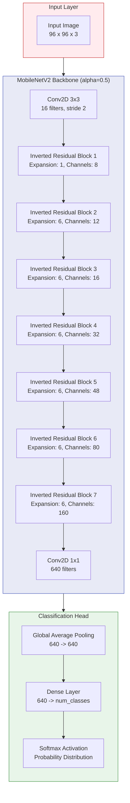

**Why MobileNetV2?**

1. **Depthwise Separable Convolutions**: Reduces computation by factorizing standard convolutions
2. **Inverted Residuals**: Expands channels in bottleneck, then compresses
3. **Linear Bottlenecks**: Preserves information in low-dimensional representations
4. **Alpha Parameter (0.5)**: Reduces channel count by 50%, yielding approximately 1.5MB model

### Transfer Learning Process

The training script (`train_facial_recognition.py`) implements transfer learning:

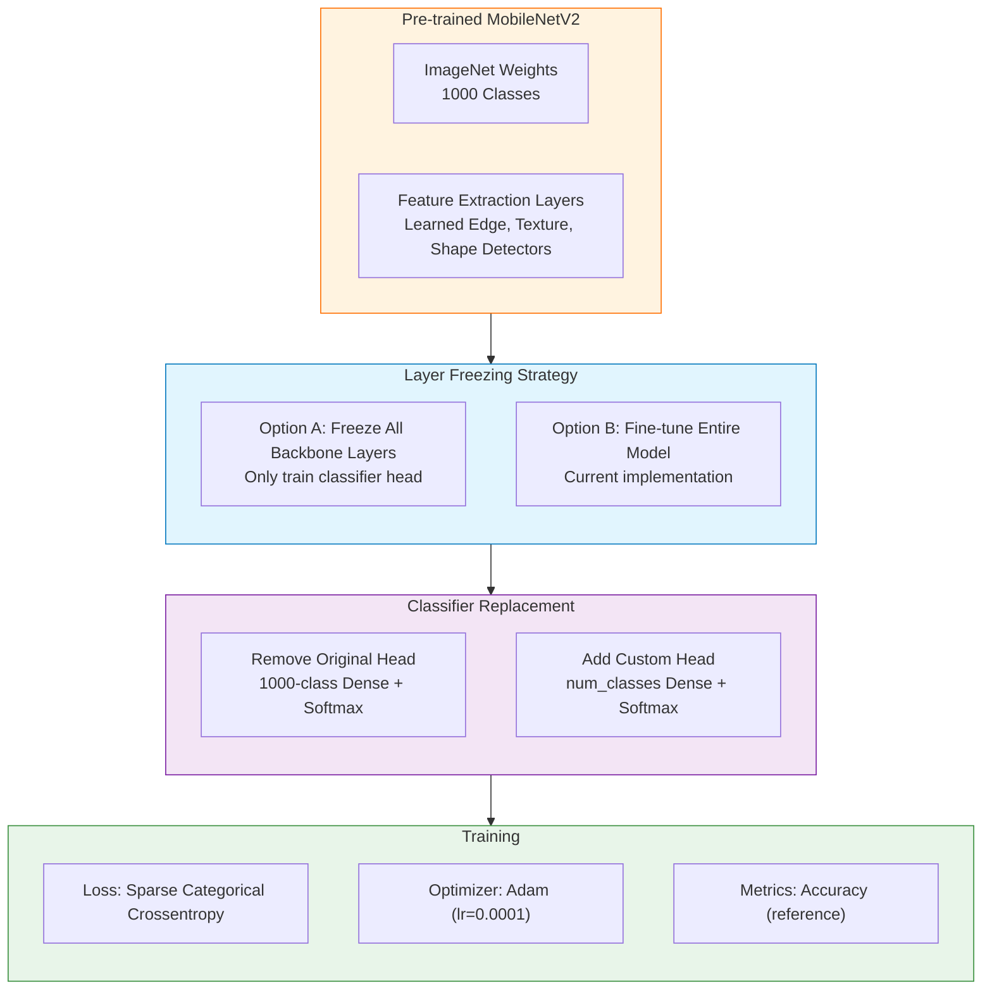

**Code Reference:**

```python
# From train_facial_recognition.py

# Pre-trained MobileNetV2 base model with original pooling
base_model = MobileNetV2(
    input_shape=(*img_size, 3),      # (96, 96, 3)
    include_top=False,                # Remove ImageNet classifier
    weights='imagenet',               # Use pre-trained weights
    alpha=CONFIG['mobilenet_alpha'],  # 0.5 = half channel width
    pooling='avg'                     # Global average pooling built-in
)

# Fine-tune entire model (all layers trainable)
base_model.trainable = True

# Build model - add custom classifier
inputs = keras.Input(shape=(*img_size, 3))
x = base_model(inputs, training=True)
outputs = layers.Dense(num_classes, activation='softmax', name='predictions')(x)

model = keras.Model(inputs=inputs, outputs=outputs, name='FacialRecognition')
```

### Data Augmentation

Class-balanced augmentation ensures equal representation across all persons:


**Augmentation Philosophy:**

- **Minimal Augmentation**: Less synthetic data means higher confidence on real faces
- **Class Balancing**: Smaller classes receive more augmentation to match the largest class
- **Conservative Transforms**: Tight parameter ranges prevent unrealistic distortions

### Training Configuration

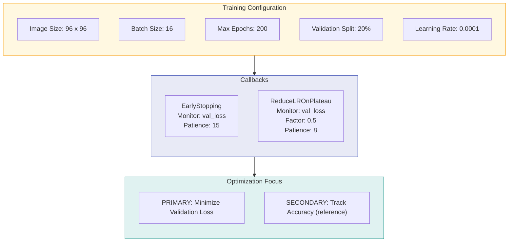

---

## Model Conversion Phase

### Keras to TFLite Conversion

The conversion process transforms the trained Keras model into a format optimized for embedded devices:

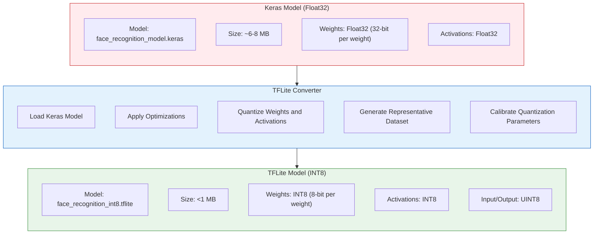

### Quantization Deep Dive

Quantization reduces model size and enables efficient integer-only inference on microcontrollers.

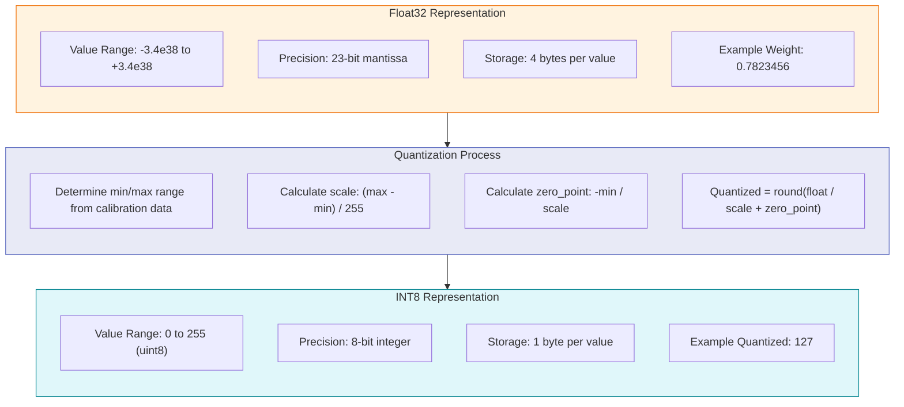

**Quantization Formula:**

```
Quantized_value = round(Float_value / scale + zero_point)
Float_value = (Quantized_value - zero_point) * scale
```

**Code Reference:**

```python
# From train_facial_recognition.py

def representative_dataset_gen():
    """Generator that yields representative samples for calibration"""
    num_samples = min(500, len(X_representative))
    indices = np.random.choice(len(X_representative), num_samples, replace=False)
    
    for i in indices:
        sample = X_representative[i:i+1].astype(np.float32)
        yield [sample]

converter = tf.lite.TFLiteConverter.from_keras_model(model)
converter.optimizations = [tf.lite.Optimize.DEFAULT]
converter.representative_dataset = representative_dataset_gen

# Force full integer quantization (int8 input/output)
converter.target_spec.supported_ops = [tf.lite.OpsSet.TFLITE_BUILTINS_INT8]
converter.inference_input_type = tf.uint8
converter.inference_output_type = tf.uint8
```

### Layer-by-Layer Comparison

This section details how each layer transforms during quantization:

```mermaid
flowchart TB
    subgraph KERAS_LAYERS["Keras Model Layers (Float32)"]
        direction TB
        KL1["Input Layer<br/>Shape: (1, 96, 96, 3)<br/>Type: float32<br/>Range: [-1.0, 1.0]"]
        KL2["Conv2D 3x3<br/>Filters: 16<br/>Weights: float32<br/>Bias: float32<br/>Activation: ReLU6"]
        KL3["DepthwiseConv2D<br/>Kernel: 3x3<br/>Weights: float32<br/>Bias: float32"]
        KL4["Conv2D 1x1 (Pointwise)<br/>Weights: float32<br/>Bias: float32"]
        KL5["Add (Residual)<br/>float32 + float32"]
        KL6["GlobalAveragePool2D<br/>Output: (1, 640)<br/>Type: float32"]
        KL7["Dense<br/>Units: num_classes<br/>Weights: float32<br/>Activation: Softmax"]
        KL1 --> KL2 --> KL3 --> KL4 --> KL5 --> KL6 --> KL7
    end

    subgraph TFLITE_LAYERS["TFLite Model Layers (INT8)"]
        direction TB
        TL1["Input Layer<br/>Shape: (1, 96, 96, 3)<br/>Type: uint8<br/>Range: [0, 255]"]
        TL2["Quantized Conv2D 3x3<br/>Filters: 16<br/>Weights: int8<br/>Bias: int32<br/>Activation: ReLU6"]
        TL3["Quantized DepthwiseConv2D<br/>Kernel: 3x3<br/>Weights: int8<br/>Bias: int32"]
        TL4["Quantized Conv2D 1x1<br/>Weights: int8<br/>Bias: int32"]
        TL5["Quantized Add<br/>int8 + int8<br/>Requires rescaling"]
        TL6["Mean (replaces GAP)<br/>Output: (1, 640)<br/>Type: int8"]
        TL7["Quantized Dense<br/>Units: num_classes<br/>Weights: int8<br/>Output: uint8 (Softmax)"]
        TL1 --> TL2 --> TL3 --> TL4 --> TL5 --> TL6 --> TL7
    end

    KERAS_LAYERS -.->|"Quantization"| TFLITE_LAYERS

    style KERAS_LAYERS fill:#ffebee,stroke:#c62828
    style TFLITE_LAYERS fill:#e8f5e9,stroke:#388e3c
```

**Detailed Layer Transformation Table:**

| Layer Type | Keras (Float32) | TFLite (INT8) | Key Changes |
|------------|-----------------|---------------|-------------|
| **Input** | float32 [-1, 1] | uint8 [0, 255] | Normalization removed; raw pixel values |
| **Conv2D** | float32 weights, float32 activations | int8 weights, int32 bias, int8 activations | Fused BatchNorm; ReLU6 clamping built-in |
| **DepthwiseConv2D** | float32 | int8 weights, int32 bias | Per-channel quantization for efficiency |
| **BatchNormalization** | Separate layer | Fused into preceding Conv | Gamma/Beta folded into weights/bias |
| **ReLU6** | max(0, min(x, 6)) | Clamping built into Conv | Integer clamping: scale-adjusted |
| **Add (Residual)** | float32 + float32 | int8 + int8 with rescaling | Different scales require requantization |
| **GlobalAveragePooling** | Spatial mean | Replaced by Mean op | Integer averaging |
| **Dense** | float32 matmul | int8 matmul, int32 accumulator | Large dynamic range in accumulator |
| **Softmax** | exp(x) / sum(exp(x)) | LUT-based approximation | Integer-only lookup table |

**Memory Footprint Comparison:**

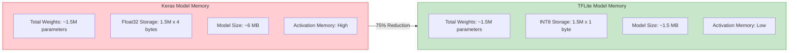

**Quantization Parameters per Layer:**

Each quantized layer stores scale and zero_point values:

```
Layer: conv1
  - Weight Scale: 0.00234
  - Weight Zero Point: 0
  - Activation Scale: 0.0156
  - Activation Zero Point: 128

Layer: depthwise_conv1
  - Weight Scale: [0.00123, 0.00145, ...] (per-channel)
  - Weight Zero Point: 0
  - Activation Scale: 0.0234
  - Activation Zero Point: 127
```

---

## Deployment Phase

### TFLite to C Header Conversion

The `convert_tflite_to_c.py` script transforms the binary TFLite model into a C header file:

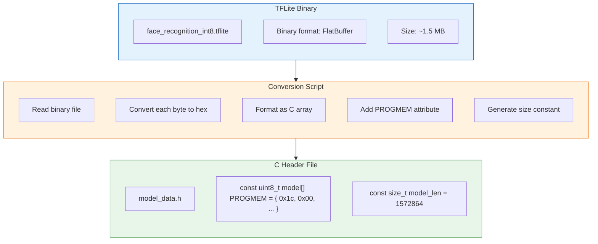

**Output Structure:**

```c
// model_data.h

const uint8_t face_recognition_model[] PROGMEM = {
    0x1c, 0x00, 0x00, 0x00, 0x54, 0x46, 0x4c, 0x33,
    0x14, 0x00, 0x20, 0x00, 0x04, 0x00, 0x08, 0x00,
    // ... (approximately 0.97 million bytes)
};

const size_t face_recognition_model_len = 978800;
```

### ESP32 Inference Pipeline

The ESP32-CAM firmware (`face_recognition_esp32cam.ino`) implements real-time inference:

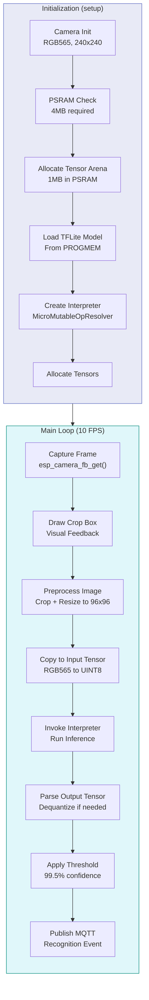

**Image Preprocessing on ESP32:**


**Code Reference (Image Preprocessing):**

```cpp
// From face_recognition_esp32cam.ino

void process_image(camera_fb_t* fb) {
    if (!fb || !input) return;

    int min_side = CROP_SIZE;
    int crop_x_start = CROP_X_OFFSET;
    int crop_y_start = CROP_Y_OFFSET;

    uint16_t* rgb565 = (uint16_t*)fb->buf;

    if (input->type == kTfLiteUInt8) {
        uint8_t* input_data = input->data.uint8;

        for (int y = 0; y < MODEL_INPUT_HEIGHT; y++) {
            for (int x = 0; x < MODEL_INPUT_WIDTH; x++) {
                // Map output coords to cropped input coords
                int src_x = crop_x_start + (x * min_side) / MODEL_INPUT_WIDTH;
                int src_y = crop_y_start + (y * min_side) / MODEL_INPUT_HEIGHT;

                // Clamp to valid range
                if (src_x >= fb->width) src_x = fb->width - 1;
                if (src_y >= fb->height) src_y = fb->height - 1;

                int src_idx = src_y * fb->width + src_x;
                uint16_t pixel = rgb565[src_idx];

                // Extract RGB from RGB565
                uint8_t r = ((pixel >> 11) & 0x1F) << 3;
                uint8_t g = ((pixel >> 5) & 0x3F) << 2;
                uint8_t b = (pixel & 0x1F) << 3;

                // Store as uint8 (0-255) - no normalization needed
                int out_idx = (y * MODEL_INPUT_WIDTH + x) * 3;
                input_data[out_idx + 0] = r;
                input_data[out_idx + 1] = g;
                input_data[out_idx + 2] = b;
            }
        }
    }
}
```

**Output Dequantization:**

```cpp
// From face_recognition_esp32cam.ino

if (output->type == kTfLiteUInt8) {
    // Quantized output - dequantize to float probability
    for (int i = 0; i < NUM_CLASSES; i++) {
        float score = (output->data.uint8[i] - output->params.zero_point)
                      * output->params.scale;
        if (score > max_score) {
            max_score = score;
            max_idx = i;
        }
    }
}
```

---

## Complete Flow Diagrams

### End-to-End Training to Deployment Flow

```mermaid
flowchart TB
    subgraph DATASET["1. Dataset Collection"]
        D1[("Capture Photos<br/>Per Person")]
        D2["Organize by Folders<br/>dataset/person_name/"]
    end

    subgraph TRAINING["2. Model Training"]
        T1["Load MobileNetV2<br/>Pre-trained on ImageNet"]
        T2["Replace Classifier Head<br/>Dense + Softmax"]
        T3["Augment Dataset<br/>Class Balancing"]
        T4["Train with Adam<br/>Loss-focused Optimization"]
        T5["Save Keras Model<br/>.keras format"]
    end

    subgraph CONVERSION["3. Model Conversion"]
        C1["Load Keras Model"]
        C2["Create Representative Dataset<br/>500 calibration samples"]
        C3["Apply INT8 Quantization<br/>Weights + Activations"]
        C4["Export TFLite Model<br/>.tflite format"]
        C5["Convert to C Header<br/>model_data.h"]
    end

    subgraph FIRMWARE["4. Firmware Development"]
        F1["Include model_data.h"]
        F2["Configure TFLite Micro<br/>Op Resolver"]
        F3["Implement Preprocessing<br/>Crop + Resize + RGB"]
        F4["Run Inference Loop<br/>10 FPS target"]
        F5["Publish via MQTT<br/>Recognition Events"]
    end

    subgraph DEPLOYMENT["5. Production Deployment"]
        DP1["Flash ESP32-CAM"]
        DP2["Connect to WiFi"]
        DP3["MQTT Broker Integration"]
        DP4["Smart Hotel Cloud"]
    end

    DATASET --> TRAINING --> CONVERSION --> FIRMWARE --> DEPLOYMENT

    style DATASET fill:#fff3e0,stroke:#ef6c00
    style TRAINING fill:#e8f5e9,stroke:#388e3c
    style CONVERSION fill:#e3f2fd,stroke:#1565c0
    style FIRMWARE fill:#f3e5f5,stroke:#7b1fa2
    style DEPLOYMENT fill:#e0f2f1,stroke:#00897b
```

### Memory Layout on ESP32

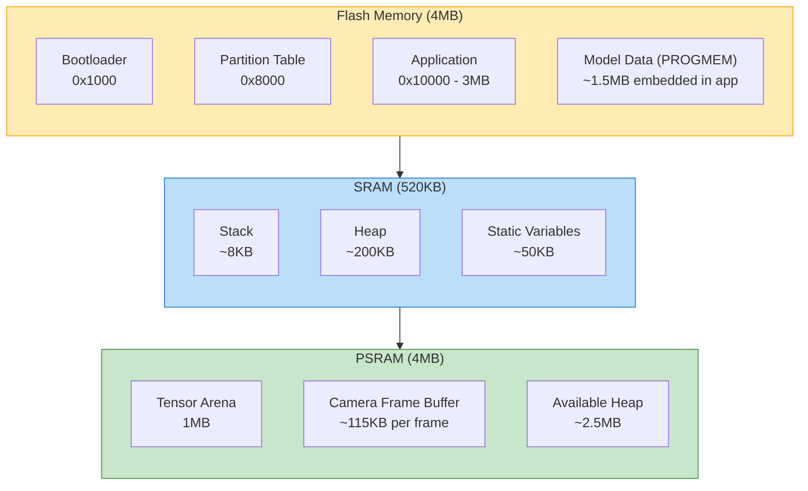

---

## Technical Specifications

### Model Specifications

| Specification | Keras Model | TFLite Model |
|--------------|-------------|--------------|
| Input Shape | (1, 96, 96, 3) | (1, 96, 96, 3) |
| Input Type | float32 [-1, 1] | uint8 [0, 255] |
| Output Shape | (1, num_classes) | (1, num_classes) |
| Output Type | float32 [0, 1] | uint8 [0, 255] |
| Model Size | ~6 MB | ~1.5 MB |
| Inference Type | Floating Point | Integer Only |
| Precision | 32-bit | 8-bit |

### ESP32-CAM Hardware Requirements

| Component | Requirement | Purpose |
|-----------|-------------|---------|
| PSRAM | 4 MB minimum | Tensor arena allocation |
| Flash | 4 MB minimum | Firmware + model storage |
| Camera | OV2640 or OV5640 | Image capture |
| WiFi | 2.4 GHz | MQTT communication |

### TFLite Micro Operations Required

```cpp
// Op resolver configuration from face_recognition_esp32cam.ino

static tflite::MicroMutableOpResolver<15> resolver;
resolver.AddConv2D();
resolver.AddDepthwiseConv2D();
resolver.AddFullyConnected();
resolver.AddSoftmax();
resolver.AddReshape();
resolver.AddAveragePool2D();
resolver.AddAdd();
resolver.AddMean();
resolver.AddQuantize();
resolver.AddDequantize();
resolver.AddPad();
resolver.AddRelu6();
```

### Performance Metrics

| Metric | Value |
|--------|-------|
| Inference Time | ~100ms |
| Frame Rate | ~10 FPS |
| Confidence Threshold | 99.5% |
| Tensor Arena Size | 1 MB |
| Power Consumption | ~200mA during inference |

---

## File Structure

```
esp32-cam/AI/
    README.md                           # This document
    dataset/                            # Training images organized by person
        person1/
        person2/
        ...
    Train_Test_Convert/
        train_facial_recognition.py     # Training pipeline
        convert_tflite_to_c.py          # TFLite to C conversion
    trained_models/
        model_YYYYMMDD_HHMMSS/
            face_recognition_model.keras
            face_recognition_int8.tflite
            class_labels.json
            training_history.json
    scripts/
        fix_dataset_index.py            # Dataset utility
    guides/
        00_START_HERE.md
        03_START_HERE.md
        ...
```

---

## Quick Reference Commands

**Train Model:**
```bash
cd Train_Test_Convert
python train_facial_recognition.py
```

**Convert to C Header:**
```bash
python convert_tflite_to_c.py ../trained_models/model_XXXX/face_recognition_int8.tflite ./output
```

**Flash ESP32-CAM:**
```bash
# Using Arduino IDE or PlatformIO
# Select board: AI Thinker ESP32-CAM
# Partition Scheme: Huge APP (3MB No OTA/1MB SPIFFS)
```

---

## References

- [MobileNetV2 Paper](https://arxiv.org/abs/1801.04381)
- [TensorFlow Lite Micro Documentation](https://www.tensorflow.org/lite/microcontrollers)
- [ESP32-CAM Datasheet](https://www.espressif.com/en/products/devkits/esp32-cam)
- [Quantization Whitepaper](https://arxiv.org/abs/1712.05877)
