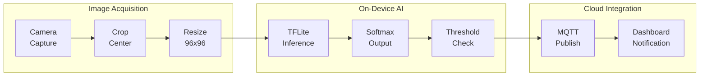
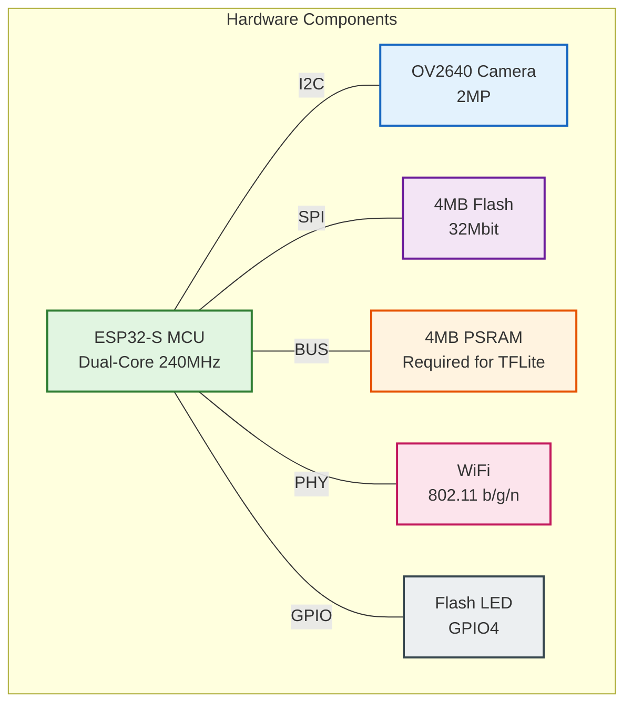
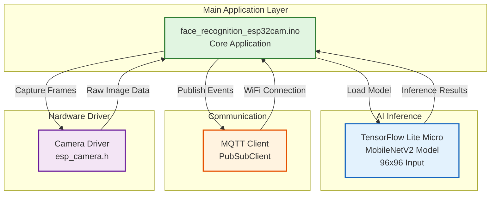
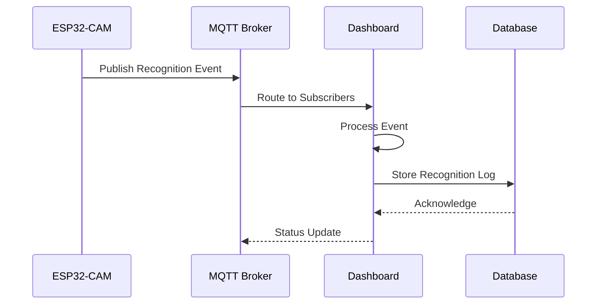

# ESP32-CAM Module


> On-device face recognition with TensorFlow Lite Micro and MQTT integration for the Smart Hotel kiosk system.

## Table of Contents

- [Overview](#overview)
- [Features](#features)
- [Hardware](#hardware)
- [Architecture](#architecture)
- [Quick Start](#quick-start)
- [Configuration](#configuration)
- [MQTT Integration](#mqtt-integration)
- [Training Custom Models](#training-custom-models)
- [Project Structure](#project-structure)
- [Troubleshooting](#troubleshooting)

## Overview

The ESP32-CAM module provides real-time face recognition capabilities for the Smart Hotel system. Using TensorFlow Lite Micro for on-device inference, it can identify registered guests and staff without cloud connectivity, publishing recognition events via MQTT to the hotel dashboard.

### Key Capabilities

| Feature | Description |
|---------|-------------|
| **On-Device AI** | MobileNetV2 model running locally on ESP32 |
| **Real-time Recognition** | ~10 FPS inference with 96x96 input |
| **MQTT Publishing** | Recognition events sent to cloud dashboard |
| **Low Latency** | <100ms inference time per frame |
| **Offline Capable** | Works without cloud, syncs when connected |
| **VIP Detection** | Instant notifications for recognized guests |

## Features

### Face Recognition Pipeline



### MQTT Communication

Real-time events published to the Smart Hotel cloud:

- **Face Recognized**: Known person identified with confidence score
- **Unknown Face**: Detection below confidence threshold
- **Device Status**: Online/offline, model health, memory usage
- **Heartbeat**: Periodic health check for monitoring

### Visual Feedback

- Green bounding box overlay on crop region
- LED flash on successful recognition
- Serial debug output with timing information

## Hardware

### ESP32-CAM AI-Thinker Module

| Specification | Value |
|---------------|-------|
| **MCU** | ESP32-S (dual-core 240MHz) |
| **Camera** | OV2640 (2MP) |
| **Flash** | 4MB (32Mbit) |
| **PSRAM** | 4MB (required for TFLite) |
| **WiFi** | 802.11 b/g/n |
| **Flash LED** | GPIO 4 |

### Pin Configuration



## Architecture

### Software Layers



### Model Specifications

| Parameter | Value |
|-----------|-------|
| **Architecture** | MobileNetV2 |
| **Input Size** | 96 × 96 × 3 (RGB) |
| **Output Classes** | 5 (configurable) |
| **Quantization** | uint8 (full integer) |
| **Model Size** | ~800KB |
| **Arena Size** | 1MB (PSRAM) |
| **Inference Time** | ~80-100ms |

## Quick Start

### Prerequisites

- Arduino IDE 2.0+ or PlatformIO
- ESP32 board support package
- USB-to-TTL adapter (FTDI) for programming

### Required Libraries

```
- TensorFlow Lite Micro for ESP32
- PubSubClient (MQTT)
- ArduinoJson
- ESP32 Camera Driver
```

### Build and Flash

1. **Configure WiFi and MQTT** (edit `mqtt_config.h`):

```cpp
#define WIFI_SSID           "YourNetworkSSID"
#define WIFI_PASSWORD       "YourWiFiPassword"

#define MQTT_BROKER         "mqtt.yourdomain.com"
#define MQTT_PORT           1883
#define MQTT_CLIENT_ID      "esp32cam-kiosk-01"
```

2. **Arduino IDE Setup**:
   - Board: "AI Thinker ESP32-CAM"
   - Partition Scheme: "Huge APP (3MB No OTA/1MB SPIFFS)"
   - PSRAM: "Enabled"

3. **Programming Mode**:
   - Connect GPIO 0 to GND
   - Press Reset button
   - Upload sketch
   - Disconnect GPIO 0 from GND
   - Press Reset to run

### First Boot Output

```
--- ESP32-CAM Face Recognition ---
Sensor: OV2640
Camera initialized
✓ Camera test OK - captured 320x240 frame
PSRAM found: 4194304 bytes
Model loaded successfully!
Input: [1, 96, 96, 3] type=3
Output classes: 5
Arena used: 892416 bytes
[WiFi] Connected! IP: 192.168.1.100
[MQTT] Connected!
[MQTT] Subscribed to: hotel/kiosk/cam01/control

--- Ready for face recognition ---

[85 ms] maha (99.2%)
[82 ms] Unknown (45.3%)
[88 ms] omar (98.7%)
```

## Configuration

### mqtt_config.h

```cpp
// WiFi Credentials
#define WIFI_SSID           "your_wifi_ssid"
#define WIFI_PASSWORD       "your_wifi_password"

// MQTT Broker Settings
#define MQTT_BROKER         "mqtt.yourdomain.com"
#define MQTT_PORT           1883
#define MQTT_CLIENT_ID      "esp32cam-kiosk-01"

// MQTT Topics
#define MQTT_TOPIC_FACE_RECOGNIZED  "/hotel/kiosk/Room1/FaceRecognition/Authentication"


// Timing
#define HEARTBEAT_INTERVAL_MS       30000
#define RECOGNITION_DEBOUNCE_MS     2000
```

### Model Configuration

```cpp
// In face_recognition_esp32cam.ino

#define MODEL_INPUT_WIDTH   96
#define MODEL_INPUT_HEIGHT  96
#define NUM_CLASSES         5

// Confidence threshold (0.0 - 1.0)
#define CONFIDENCE_THRESHOLD 0.995f

// Class labels (must match training)
static const char* kLabels[] = {
    "maha",
    "mokhtar", 
    "omar",
    "radwan",
    "tarek"
};
```

## MQTT Integration

### Message Flow Sequence



### Published Topics

#### Face Recognized
```
Topic: hotel/kiosk/{room_id}/FaceRecognition/Authentication 
Payload: {
    "name": "person_name",
    "confidence": 0.987,
    "timestamp": 1234567890,
    "device": "esp32cam-kiosk-01"
}
```
### Dashboard Integration

The Smart Hotel dashboard automatically subscribes to ESP32-CAM topics:

```python
# In dashboard/mqtt_client.py

# Recognition events trigger:
# - Cache storage for kiosk auto-fill
# - VIP notifications via Telegram
# - Real-time WebSocket updates

# Device status triggers:
# - Health monitoring alerts
# - Admin dashboard updates
```

## Training Custom Models

### Dataset Collection

Use the `ESP_Capture_dataset` sketch to collect training images:

```bash
cd esp32-cam/ESP_Capture_dataset
# Upload to ESP32-CAM
# Access web interface to capture images
```

### Training Pipeline

```bash
cd esp32-cam/ai

# Install dependencies
pip install -r requirements.txt

# Train model
python train_facial_recognition.py

# Convert to TFLite
python convert_tflite_to_c.py

# Output: model_data.h (copy to face_recognition_esp32cam/)
```

### Model Requirements

- Input: 96x96 RGB images
- Output: Softmax over N classes
- Quantization: Full integer (uint8)
- Size: Must fit in ~1MB PSRAM arena

## Project Structure

```
esp32-cam/
├── README.md                       # This file
├── fix_dataset_index.py            # Dataset utility
│
├── face_recognition_esp32cam/      # Main firmware
│   ├── face_recognition_esp32cam.ino  # Main application
│   ├── board_config.h              # Board selection
│   ├── cam_config.h                # Camera settings
│   ├── camera_pins.h               # Pin definitions
│   ├── class_labels.h              # Recognition labels
│   ├── model_data.h                # TFLite model (PROGMEM)
│   ├── mqtt_config.h               # MQTT settings
│   └── mqtt_client.h               # MQTT client class
│
├── ESP_Capture_dataset/            # Dataset collection tool
│   ├── ESP_Capture_dataset.ino
│   ├── board_config.h
│   ├── cam_config.h
│   ├── camera_pins.h
│   └── web_server.h
│
└── ai/                             # Training scripts
    ├── requirements.txt
    ├── train_facial_recognition.py
    ├── convert_tflite_to_c.py
    ├── test_camera.py
    ├── test_camera_float.py
    └── test_model.ipynb
```

## Troubleshooting

### Camera Issues

**"Camera init failed"**
- Check board selection matches hardware
- Verify PSRAM is enabled
- Ensure proper power supply (5V, 500mA+)

**"Camera test FAILED"**
- Camera ribbon cable may be loose
- Try different camera module
- Check for physical damage

### Model Issues

**"AllocateTensors failed"**
- Increase `kTensorArenaSize`
- Enable PSRAM in board settings
- Check model fits in available memory

**"Model version mismatch"**
- Regenerate model with matching TFLite version
- Update TensorFlow Lite Micro library

### MQTT Issues

**"Connection failed, rc=-2"**
- Verify broker address and port
- Check WiFi connectivity
- Ensure broker is running

**Messages not appearing in dashboard**
- Verify topic structure matches subscription
- Check MQTT broker logs
- Test with MQTT client (mosquitto_sub)

### Performance Issues

**Low FPS / Slow inference**
- Reduce camera resolution
- Check for memory fragmentation
- Monitor free heap in serial output

---

**Built for real-time on-device face recognition in hotel environments.**
