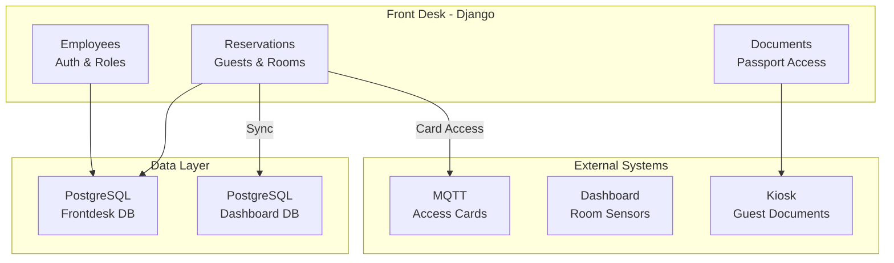

# Frontdesk - Hotel Front Desk Management System

A Django-based front desk management application for hotel employees.

## Features

- **Employee Management**: Admin can create and manage employee accounts
- **Reservation Management**: Create, edit, check-in, and check-out reservations
- **Guest Management**: Track guest information and history
- **Document Access**: View guest documents and passports from kiosk
- **Room Management**: Monitor room status and availability
- **Activity Logging**: Audit trail for all actions

## Architecture

```text
frontdesk/
├── frontdesk_project/    # Django project settings
├── employees/            # Employee authentication & management
├── reservations/         # Reservation & room management
├── documents/            # Document access & kiosk sync
└── templates/            # HTML templates
```

## Security

- **Separate Database**: Employee passwords stored in isolated PostgreSQL database
- **Argon2 Hashing**: Most secure password hashing algorithm
- **Activity Logging**: All actions are logged with timestamps and IP addresses
- **Role-Based Access**: Admin, Manager, and Receptionist roles

## Quick Start

### With Docker (Recommended)

```bash
cd cloud
./generate-env.sh  # Generate environment variables
docker compose up -d
```

Access at: <http://localhost:8003>

Default credentials (from .env):

- Username: `admin`
- Password: Check `FRONTDESK_ADMIN_PASSWORD` in `.env`

### Development (Local)

```bash
cd frontdesk

# Create virtual environment
python -m venv venv
source venv/bin/activate

# Install dependencies
pip install -r requirements.txt

# Set environment variables
export FRONTDESK_DB=frontdesk
export FRONTDESK_DB_USER=frontdesk
export FRONTDESK_DB_PASSWORD=your_password
export FRONTDESK_DB_HOST=localhost
export FRONTDESK_DB_PORT=5432
export DJANGO_SECRET_KEY=your_secret_key
export DJANGO_DEBUG=True

# Run migrations
python manage.py migrate

# Create admin user
python manage.py create_admin --username admin --password admin123

# Create sample rooms
python manage.py create_sample_rooms

# Run development server
python manage.py runserver 0.0.0.0:8003
```

## Integration

### Kiosk Integration

The frontdesk app can access documents uploaded via the kiosk:

```python
# Environment variables
KIOSK_API_URL=http://kiosk:8000/api
KIOSK_MEDIA_URL=http://kiosk:8000/media
KIOSK_API_TOKEN=<token>
```

### MQTT (Room Access Cards)

```python
# Environment variables
MQTT_BROKER=mosquitto
MQTT_PORT=1883
```

## API Endpoints

| Endpoint | Method | Description |
| ---------- | -------- | ------------- |
| `/` | GET | Dashboard |
| `/reservations/` | GET | Reservation list |
| `/reservations/create/` | GET/POST | Create reservation |
| `/reservations/<id>/` | GET | Reservation detail |
| `/reservations/<id>/check-in/` | GET/POST | Check-in |
| `/reservations/<id>/check-out/` | GET/POST | Check-out |
| `/guests/` | GET | Guest list |
| `/rooms/` | GET | Room list |
| `/documents/` | GET | Document list |
| `/accounts/employees/` | GET | Employee list (admin only) |

## Management Commands

```bash
# Create admin user
python manage.py create_admin --username admin --password secure_password

# Create sample rooms
python manage.py create_sample_rooms

# Sync rooms to dashboard (requires DASHBOARD_DB_* env vars)
python manage.py sync_rooms_to_dashboard
```

## Environment Variables

| Variable | Description | Default |
| ---------- | -------- | ------------- |
| `FRONTDESK_DB` | Database name | `frontdesk` |
| `FRONTDESK_DB_USER` | Database user | `frontdesk` |
| `FRONTDESK_DB_PASSWORD` | Database password | Required |
| `FRONTDESK_DB_HOST` | Database host | `postgres-frontdesk` |
| `FRONTDESK_DB_PORT` | Database port | `5432` |
| `DJANGO_SECRET_KEY` / `FRONTDESK_SECRET_KEY` | Django secret | Required |
| `DJANGO_DEBUG` | Debug mode | `False` |
| `KIOSK_API_URL` | Kiosk API endpoint | `http://kiosk:8000/api` |
| `KIOSK_MEDIA_URL` | Kiosk media URL | `http://kiosk:8000/media` |
| `MQTT_BROKER` | MQTT broker host | `mosquitto` |
| `MQTT_PORT` | MQTT port | `1883` |

## Employee Roles

| Role | Permissions |
| ------ | -------- |
| **Admin** | Full access, manage employees |
| **Manager** | Full reservation access, view reports |
| **Receptionist** | Basic reservation operations |

## Architecture Diagram



## License

Part of the Smart Hotel project.
