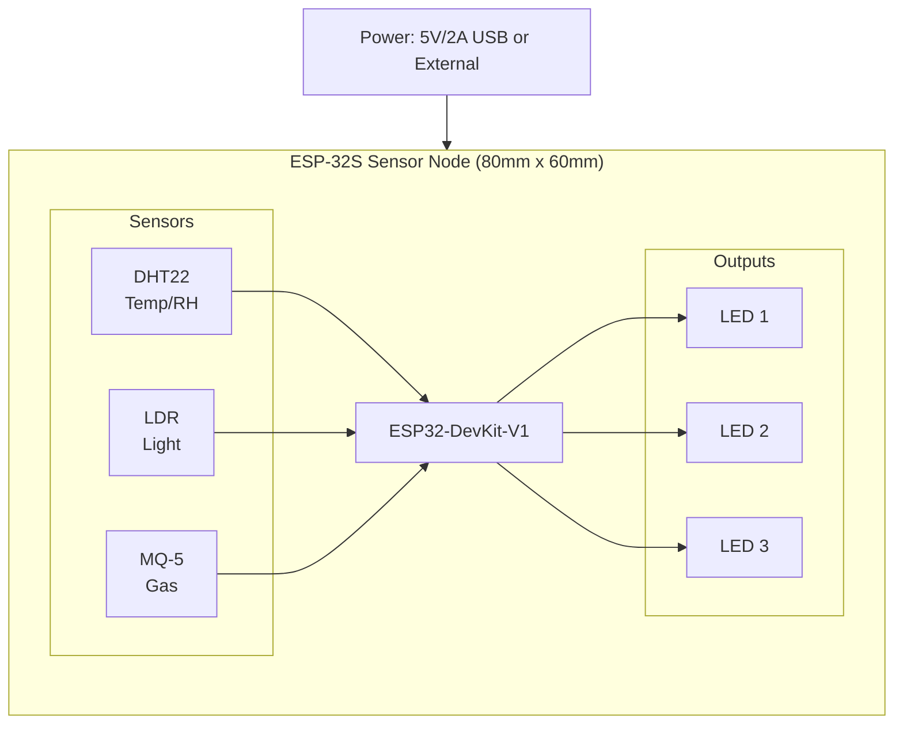
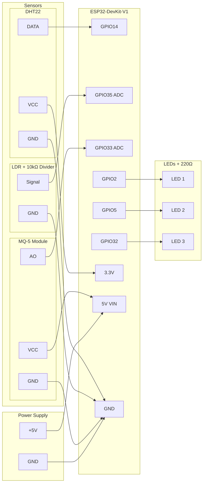

# Smart Hotel Hardware


> Custom PCB designs and hardware documentation for the Smart Hotel IoT sensor nodes.

## Table of Contents

- [Overview](#overview)
- [PCB Design](#pcb-design)
- [Components](#components)
- [Manufacturing](#manufacturing)
- [Assembly Guide](#assembly-guide)
- [Sensor Specifications](#sensor-specifications)
- [Wiring Diagrams](#wiring-diagrams)

## Overview

This directory contains hardware designs for the Smart Hotel room sensor nodes. The custom PCB provides a compact, reliable platform for ESP32-based environmental monitoring and control.

### Supported Configurations

| Configuration | Sensors | Actuators | Use Case |
| --------------- | --------- | ----------- | ---------- |
| **Full Suite** | DHT22, LDR, MQ-5 | LEDs, Fan relay | Complete room monitoring |
| **Climate Only** | DHT22 | Fan relay | HVAC control |
| **Light Only** | LDR | LEDs | Lighting automation |
| **Safety** | MQ-5 | Buzzer, LEDs | Gas leak detection |

## PCB Design

### ESP-32S PCB

Located in `ESP-32S PCB/`, this is the main sensor node PCB.



### Design Files

| File | Description |
| --------------- | ------------- |
| `Gerber_TopLayer.GTL` | Top copper layer |
| `Gerber_BottomLayer.GBL` | Bottom copper layer |
| `Gerber_TopSilkscreenLayer.GTO` | Component labels (top) |
| `Gerber_TopSolderMaskLayer.GTS` | Solder mask (top) |
| `Gerber_BottomSolderMaskLayer.GBS` | Solder mask (bottom) |
| `Gerber_BoardOutlineLayer.GKO` | Board outline/dimensions |
| `Drill_PTH_Through.DRL` | Plated through-hole drill |
| `Drill_PTH_Through_Via.DRL` | Via drill file |

### Board Specifications

| Parameter | Value |
| --------------- | ------- |
| **Dimensions** | 80mm × 60mm |
| **Layers** | 2 (top and bottom copper) |
| **Copper Weight** | 1 oz (35μm) |
| **Board Thickness** | 1.6mm |
| **Surface Finish** | HASL (lead-free) |
| **Solder Mask** | Green |
| **Silkscreen** | White |

## Components

### Bill of Materials (BOM)

| Qty | Component | Value/Model | Package | Notes |
| ----- | ----------- | ------------- | --------- | ------- |
| 1 | ESP32-DevKit-V1 | ESP-WROOM-32 | 38-pin | Main MCU |
| 1 | DHT22 | AM2302 | 4-pin | Temp/humidity sensor |
| 1 | LDR | GL5528 | 5mm | Light-dependent resistor |
| 1 | MQ-5 | MQ-5 module | 4-pin | Combustible gas sensor |
| 3 | LED | 5mm diffused | Through-hole | Status/room lights |
| 3 | Resistor | 220Ω | 0805 | LED current limiting |
| 1 | Resistor | 10kΩ | 0805 | LDR pull-down |
| 1 | Resistor | 4.7kΩ | 0805 | DHT22 pull-up |
| 2 | Capacitor | 100nF | 0805 | Decoupling |
| 1 | Capacitor | 10μF | 0805 | Power filtering |
| 1 | Terminal Block | 2-pin | 5.08mm | Power input |
| 1 | USB-C Connector | - | SMD | Optional USB power |

### Vendor Sources

| Component | Recommended Vendor |
| --------------- | ------------------- |
| ESP32-DevKit | AliExpress, Amazon, Mouser |
| DHT22 | Adafruit, SparkFun, AliExpress |
| MQ-5 | Amazon, AliExpress |
| LDR | DigiKey, Mouser, AliExpress |
| Passive components | LCSC, DigiKey, Mouser |

## Manufacturing

### Ordering PCBs

The Gerber files in `ESP-32S PCB/` are ready for production. See `How-to-order-PCB.txt` for step-by-step instructions.

#### Recommended PCB Manufacturers

| Manufacturer | Lead Time | Min Order | Notes |
| --------------- | ----------- | ----------- | ------- |
| **JLCPCB** | 3-5 days | 5 pcs | Best value, SMT assembly available |
| **PCBWay** | 3-5 days | 5 pcs | Good quality, more options |
| **OSH Park** | 12 days | 3 pcs | High quality, US-based |
| **Seeed Fusion** | 7 days | 10 pcs | SMT assembly available |

#### Order Settings

When ordering, use these settings:

```text
Layers: 2
Dimensions: 80mm x 60mm
PCB Qty: 5 (minimum)
PCB Thickness: 1.6mm
PCB Color: Green (or preference)
Surface Finish: HASL (lead-free)
Copper Weight: 1oz
```

### Ordering with Assembly

For SMT assembly (JLCPCB or PCBWay):

1. Upload Gerber files
2. Upload BOM file (create from component list)
3. Upload Pick-and-Place file (CPL)
4. Select "Economic" or "Standard" assembly
5. Review component placement

## Assembly Guide

### Required Tools

- Soldering iron (temperature-controlled)
- Solder (63/37 or lead-free)
- Flux
- Wire strippers
- Multimeter
- Heat shrink tubing (optional)

### Assembly Steps

#### Step 1: SMD Components (if not pre-assembled)

1. Apply solder paste to pads
2. Place 0805 resistors and capacitors
3. Reflow or hand-solder

#### Step 2: Through-Hole Components

1. **ESP32 headers**: Solder female headers for ESP32 module
2. **Sensor headers**: Solder 4-pin headers for DHT22 and MQ-5
3. **LEDs**: Observe polarity (long leg = anode = +)
4. **Terminal block**: Solder power input connector

#### Step 3: Module Installation

1. Insert ESP32-DevKit into headers
2. Connect DHT22 (VCC, Data, NC, GND)
3. Connect MQ-5 module (VCC, GND, DO, AO)
4. Insert LDR into designated pads

#### Step 4: Testing

```bash
# Flash test firmware
cd ../esp32
pio run -t upload

# Monitor serial output
pio device monitor -b 115200
```

Expected output:

```text
[WIFI] Connecting to network...
[WIFI] Connected! IP: 192.168.1.x
[MQTT] Connected to broker
[DHT22] Temp: 22.5°C, Humidity: 45%
[LDR] Light level: 512
[MQ5] Gas level: 120
```

## Sensor Specifications

### DHT22 (Temperature & Humidity)

| Parameter | Specification |
| ----------- | --------------- |
| **Temperature Range** | -40°C to 80°C |
| **Temperature Accuracy** | ±0.5°C |
| **Humidity Range** | 0-100% RH |
| **Humidity Accuracy** | ±2% RH |
| **Sample Rate** | 0.5 Hz (2 seconds) |
| **Operating Voltage** | 3.3V - 5V |

### LDR GL5528 (Light Sensor)

| Parameter | Specification |
| ----------- | --------------- |
| **Light Resistance** | 10-20 kΩ (10 lux) |
| **Dark Resistance** | 1 MΩ |
| **Response Time** | 20-30 ms (rise), 30 ms (fall) |
| **Spectral Peak** | 540 nm (green) |
| **Operating Voltage** | 3.3V (with 10kΩ divider) |

### MQ-5 (Gas Sensor)

| Parameter | Specification |
| ----------- | --------------- |
| **Target Gases** | LPG, natural gas, coal gas |
| **Detection Range** | 200-10000 ppm |
| **Preheat Time** | 24-48 hours (initial) |
| **Heater Voltage** | 5V |
| **Operating Voltage** | 5V |

## Wiring Diagrams

### Full Sensor Node



### Power Considerations

| Power Source | Voltage | Current | Notes |
| -------------- | --------- | --------- | ------- |
| USB | 5V | 500mA | Development only |
| USB-C PD | 5V | 2A | Recommended |
| External PSU | 5V | 2A | Production deployment |

**Current Budget:**

- ESP32: 80-240mA (depends on WiFi activity)
- DHT22: 1.5mA (during read)
- LDR circuit: <1mA
- MQ-5: 150mA (heater)
- LEDs: 60mA (3 × 20mA max)
- **Total**: ~500mA typical, 800mA peak

## Design Screenshots

| Preview | Description |
| --------- | ------------- |
|  | PCB top layer layout |
|  | PCB bottom layer / assembled |

---

**Custom hardware designed for reliable hotel IoT deployments.**
