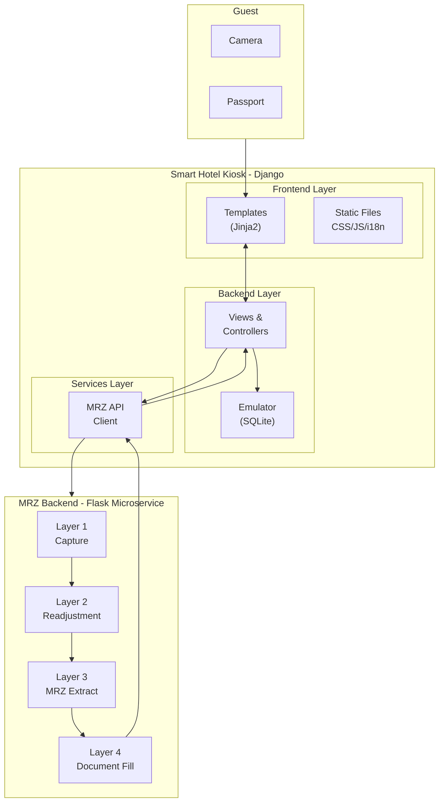
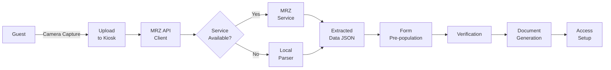

# Smart Hotel Self Check-in Kiosk


> A modern, multilingual self-service check-in kiosk system for hotels featuring passport scanning, MRZ extraction, document generation, and multiple access methods.

## Table of Contents

- [Overview](#overview)
- [Features](#features)
- [Architecture](#architecture)
- [Guest Journey](#guest-journey)
- [Quick Start](#quick-start)
- [Configuration](#configuration)
- [API Reference](#api-reference)
- [Project Structure](#project-structure)
- [Internationalization](#internationalization)
- [Theming](#theming)
- [Security](#security)

## Overview

The Smart Hotel Kiosk is a self-service check-in system designed for hotel lobbies. Guests can complete their entire check-in process without staff assistance—from passport scanning to keycard collection. The system integrates with the MRZ Automation AI backend for intelligent passport processing and supports multiple access methods including keycards and facial recognition.

Built with Django and modern web technologies, the kiosk provides a touch-friendly interface optimized for large displays while maintaining a professional, accessible design suitable for international guests.

## Features

### Passport Scanning & MRZ Extraction
- **Browser-based camera capture** - No hardware drivers required
- **Real-time document detection** - Visual feedback for positioning
- **Manual capture with automatic extraction** - Guests press a `Capture` button to take a high-quality frame; MRZ parsing is then performed via the microservice. An `Enter Manually` option is also available to type passport details when scanning is not possible.
- **Fallback processing** - Local parser when service unavailable
- **Multi-document support** - TD1, TD2, TD3 formats (passports, ID cards)

### Guest Check-in Flow
- **Multi-language support** - English, German, Polish, Ukrainian, Russian
- **Automatic form population** - MRZ data fills registration fields
- **Digital signatures** - Touch-enabled signature capture
- **PDF generation** - Registration cards for guest records
- **Reservation lookup** - Find booking by number or guest details

### Access Methods
- **Keycard encoding** - Traditional magnetic/RFID keycards
- **Facial recognition** - Camera-based enrollment for room access
- **PIN codes** - Backup access method
- **Multi-person support** - Register multiple guests per room

### Professional Theming
- **Seasonal themes** - Winter holiday theme with CSS decorations
- **Responsive design** - Optimized for kiosk displays (1080p+)
- **Accessibility** - High contrast, large touch targets
- **Branding ready** - Easy customization for hotel identity

## Architecture

The kiosk follows a **microservice architecture** where passport processing is handled by a separate MRZ backend service. This separation allows independent scaling and deployment.



### Component Responsibilities

| Component | Purpose |
|-----------|---------|
| **Kiosk (Django)** | Guest-facing web interface, session management, business logic |
| **MRZ Backend (Flask)** | Passport image processing, OCR, document generation |
| **Emulator Module** | In-memory/SQLite data store for demo mode |
| **MRZ API Client** | HTTP client for microservice communication |
| **Document Filler** | DOCX template population with guest data |

### Data Flow



## Guest Journey

### Step 1: Advertisement & Language Selection
Guest approaches the kiosk and sees a welcome screen. They select their preferred language from 5 options: English, German, Polish, Ukrainian, or Russian.

### Step 2: Check-in Start
Guest chooses to begin the check-in process. Clear instructions guide them through each step.

### Step 3: Passport Scanning
The kiosk activates the camera for passport scanning:
- Real-time preview shows camera feed
- Green overlay indicates document detection
- Guest holds passport steady and presses **Capture** when positioned correctly
- System extracts MRZ data from the captured frame; alternatively the guest may choose **Enter Manually** to type their passport details

### Step 4: Information Verification
Extracted passport data is displayed for verification:
- First name, last name, date of birth
- Passport number and nationality
- Guest can edit any incorrect fields
- Reservation number entry (optional)

### Step 5: DW Registration Card
Guest fills out the required registration form:
- Address and contact information
- Travel purpose and companions
- Digital signature capture
- PDF generation for records

### Step 6: Access Method Selection
Guest chooses how to access their room:
- **Keycard**: Traditional key encoding
- **Facial Recognition**: Camera enrollment for biometric access

### Step 7: Finalization
Check-in completes with:
- Keycard dispensing (if selected)
- Room number and directions
- Welcome information

## Quick Start

### Local Development

```bash
# Navigate to kiosk directory
cd kiosk

# Create virtual environment
python -m venv venv
source venv/bin/activate  # Linux/Mac
# or: venv\Scripts\activate  # Windows

# Install dependencies
pip install -r requirements.txt

# Initialize database
python manage.py migrate

# Collect static files
python manage.py collectstatic --noinput

# Run development server
python manage.py runserver 0.0.0.0:8000
```

Access the kiosk at `http://localhost:8000`

### Docker Deployment

```bash
# From project root
cd cloud

# Production mode
docker compose up kiosk mrz-backend

# Development mode (exposes MRZ frontend for testing)
docker compose -f docker-compose-dev.yml up kiosk mrz-backend
```

## Configuration

### Environment Variables

| Variable | Description | Default |
|----------|-------------|---------|
| `DEBUG` | Django debug mode | `0` |
| `SECRET_KEY` | Django secret key | `replace-me-in-production` |
| `ALLOWED_HOSTS` | Allowed hostnames | `*` |
| `MRZ_SERVICE_URL` | MRZ backend URL | `http://mrz-backend:5000` |

### Settings Overview

Key settings in `kiosk_project/settings.py`:

```python
# MRZ Service Configuration
MRZ_SERVICE_URL = os.environ.get('MRZ_SERVICE_URL', 'http://localhost:5000')

# Media directories
MEDIA_ROOT = os.path.join(BASE_DIR, 'media')
TEMP_SCANS_DIR = os.path.join(MEDIA_ROOT, 'temp_scans')
FILLED_DOCS_DIR = os.path.join(MEDIA_ROOT, 'filled_documents')
```

## API Reference

### Passport Processing

| Endpoint | Method | Description |
|----------|--------|-------------|
| `/upload-scan/` | POST | Upload passport image for MRZ extraction |
| `/extract/status/<task_id>/` | GET | Check extraction task status |
| `/api/save-passport-data/` | POST | Save verified passport data |

### MRZ Proxy Endpoints

| Endpoint | Method | Description |
|----------|--------|-------------|
| `/api/mrz/detect/` | POST | Detect document in image |
| `/api/mrz/extract/` | POST | Extract MRZ from image |
| `/api/mrz/health/` | GET | MRZ service health check |

### Registration Flow

| Endpoint | Method | Description |
|----------|--------|-------------|
| `/verify/` | POST | Submit verified guest information |
| `/dw-registration/` | GET | Display registration card form |
| `/dw-registration/sign/` | POST | Submit signed registration |
| `/dw-registration/print/` | POST | Generate PDF registration card |

### Access Management

| Endpoint | Method | Description |
|----------|--------|-------------|
| `/choose-access/<res_id>/` | GET | Access method selection |
| `/enroll-face/<res_id>/` | GET | Facial recognition enrollment |
| `/face-capture/<res_id>/` | POST | Capture face images |
| `/save-faces/<res_id>/` | POST | Save enrolled faces |
| `/submit-keycards/<res_id>/` | POST | Finalize keycard access |

## Project Structure

```
kiosk/
├── manage.py                   # Django management script
├── requirements.txt            # Python dependencies
├── Dockerfile                  # Container build instructions
├── docker-entrypoint.sh        # Container startup script
│
├── kiosk/                      # Main application
│   ├── views.py                # View controllers (952 lines)
│   ├── urls.py                 # URL routing
│   ├── emulator.py             # In-memory data store
│   ├── mrz_parser.py           # Local MRZ parsing
│   ├── mrz_api_client.py       # MRZ service client
│   ├── document_filler.py      # DOCX template handling
│   └── context_processors.py   # Template context
│
├── kiosk_project/              # Django project settings
│   ├── settings.py             # Configuration
│   ├── urls.py                 # Root URL config
│   └── wsgi.py                 # WSGI application
│
├── templates/                  # HTML templates
│   ├── base.html               # Base layout with theme
│   └── kiosk/                  # Kiosk-specific templates
│       ├── start.html
│       ├── passport_scan.html
│       ├── verify.html
│       ├── dw_registration.html
│       └── ...
│
├── static/                     # Static assets
│   ├── css/
│   │   ├── style.css           # Main styles
│   │   └── christmas-theme.css # Holiday theme
│   ├── js/                     # JavaScript modules
│   ├── i18n/                   # Translation JSON files
│   └── vendor/                 # Third-party libraries
│
├── media/                      # User uploads
│   ├── temp_scans/             # Temporary passport images
│   └── filled_documents/       # Generated PDFs
│
└── app/                        # MRZ Backend (Flask)
    ├── app.py                  # Flask application
    ├── requirements.txt        # Flask dependencies
    └── layer1_capture/         # Camera handling
    └── layer2_readjustment/    # Image processing
    └── layer3_mrz/             # MRZ extraction
    └── layer4_document_filling/ # Document generation
```

## Internationalization

The kiosk supports 5 languages with client-side translation:

| Language | Code | Flag |
|----------|------|------|
| English | `en` | 🇬🇧 |
| German | `de` | 🇩🇪 |
| Polish | `pl` | 🇵🇱 |
| Ukrainian | `uk` | 🇺🇦 |
| Russian | `ru` | 🇷🇺 |

Translation files are stored in `static/i18n/` as JSON:

```json
{
  "welcome_title": "Welcome to Smart Hotel",
  "scan_passport": "Please scan your passport",
  "continue": "Continue"
}
```

Language selection persists in browser session storage.

## Theming

### Current Theme: Winter Holiday 🎄

The kiosk features a professional winter holiday theme with:
- Animated snowfall (CSS-only, no JavaScript)
- Frosted glass card effects
- Winter color palette (deep blue, evergreen, gold accents)
- Decorative evergreen trees in footer

### Customizing Themes

Themes are controlled via CSS files in `static/css/`:

```css
/* christmas-theme.css - CSS Variables */
:root {
    --brand: #1a5f2a;           /* Evergreen */
    --brand-light: #2e8b47;     /* Light pine */
    --accent: #c9a227;          /* Gold */
    --bg: #0a1628;              /* Deep winter blue */
    --card-bg: rgba(255, 255, 255, 0.05);
}
```

To create a new theme:
1. Copy `christmas-theme.css` as template
2. Modify CSS variables for your colors
3. Update decorative elements (snowfall, trees, etc.)
4. Link new stylesheet in `base.html`

## Security

### Production Recommendations

- **Always set a unique `SECRET_KEY`** in production
- **Set `DEBUG=0`** to disable debug mode
- **Configure ALLOWED_HOSTS** with specific hostnames
- **Use HTTPS** for all kiosk communications
- **Restrict MRZ service** to internal network only

### Data Handling

- Passport images are processed and immediately deleted
- Extracted data stored only in session/emulator
- PDF registration cards saved with timestamp naming
- No permanent storage of biometric data

### Input Validation

- All form inputs sanitized before processing
- File uploads restricted to image types
- MRZ data validated against check digits
- Session tokens prevent CSRF attacks
