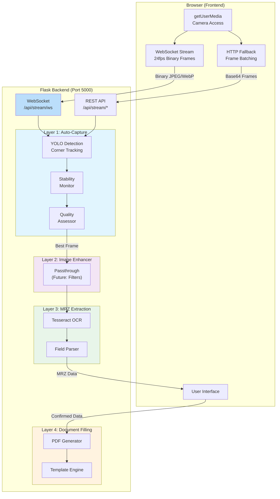
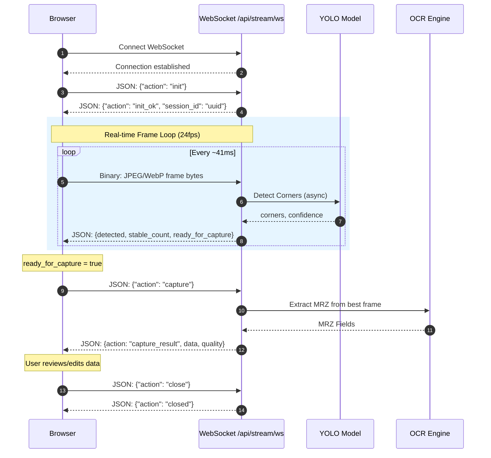
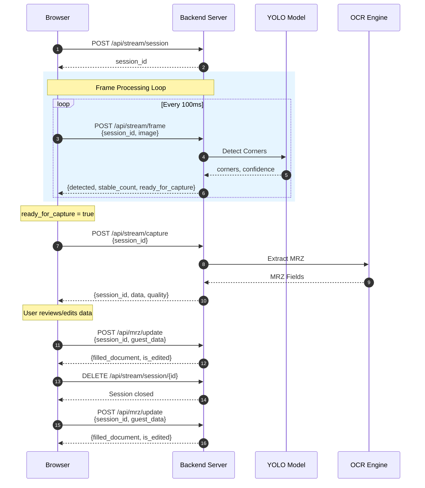

# MRZ Backend Service v3.3.0


> **WebRTC Backend Mode** - Camera handled by browser, server processes frames via WebSocket or HTTP

A production-grade Flask microservice for passport/ID document processing with MRZ (Machine Readable Zone) extraction, document detection, and PDF generation. Supports real-time 24fps video streaming via WebSocket for optimal performance.

---

## Architecture Overview



---

## Key Features

### Layer 1 — Auto-Capture (WebRTC Mode)

- **YOLO-based document detection** with 4-corner keypoint tracking
- **Virtual padding** for better edge detection
- **Stability tracking** - waits for document to be still
- **Burst capture** - captures multiple frames for quality selection
- **Quality assessment** - sharpness, contrast, brightness, noise analysis
- **Stream session management** - handles multiple concurrent sessions
- **Async background detection** - non-blocking YOLO inference

### Real-time Streaming Options

- **WebSocket (Recommended)** - `/api/stream/ws` for 24fps real-time streaming
  - Binary JPEG/WebP frames for zero encoding overhead
  - Bi-directional JSON commands and detection results
  - Lowest latency, highest throughput
- **HTTP Batch** - `/api/stream/video/frames` for frame batching
  - Gzip compression support for bandwidth optimization
  - Fallback when WebSocket unavailable
- **HTTP Single Frame** - `/api/stream/frame` for simple integration

### Layer 2 — Image Enhancer

- **Passthrough mode** by default
- **Future enhancements ready**:
  - INTER_LANCZOS4 upscaling
  - Unsharp mask sharpening
  - CLAHE contrast enhancement
  - FastNlMeans denoising

### Layer 3 — MRZ Extraction

- Tesseract OCR with MRZ-optimized training data
- Field parsing and validation
- JSON output with all passport fields

### Layer 4 — Document Filling

- PDF template filling
- Automatic field mapping
- Registration card generation

---

## API Flow

### WebSocket Mode (Recommended - 24fps Real-time)



### HTTP Stream Mode Flow (Fallback)



---

## API Endpoints

### Health & Status

| Endpoint | Method | Description |
| ---------- | -------- | ------------- |
| `/health` | GET | Health check with model status, WebSocket support, active sessions |
| `/api/status` | GET | Detailed service status and all endpoint listing |

### WebSocket Real-time Streaming (24fps)

| Endpoint | Protocol | Description |
| ---------- | -------- | ------------- |
| `/api/stream/ws` | **WebSocket** | Real-time binary frame streaming. See protocol below. |

**WebSocket Protocol:**

| Message Type | Direction | Format | Description |
| -------------- | --------- | -------- | ------------- |
| Init | Client→Server | `{"action": "init", "session_id": "optional"}` | Initialize session |
| Init OK | Server→Client | `{"action": "init_ok", "session_id": "uuid"}` | Session ready |
| Frame | Client→Server | Binary JPEG/WebP bytes | Send video frame |
| Detection | Server→Client | `{"detected": true, "stable_count": N, ...}` | Detection result |
| Capture | Client→Server | `{"action": "capture"}` | Trigger MRZ extraction |
| Capture Result | Server→Client | `{"action": "capture_result", "data": {...}}` | MRZ data |
| Close | Client→Server | `{"action": "close"}` | End session |
| Ping | Client→Server | `{"action": "ping"}` | Keep-alive |
| Pong | Server→Client | `{"action": "pong"}` | Keep-alive response |

### HTTP Stream Mode (Fallback)

| Endpoint | Method | Description |
| ---------- | -------- | ------------- |
| `/api/stream/session` | POST | Create new stream session |
| `/api/stream/session/<id>` | DELETE | Close stream session |
| `/api/stream/frame` | POST | Process single frame (supports gzip) |
| `/api/stream/capture` | POST | Capture best frame from session |
| `/api/stream/video` | POST | Process video chunk (WebM/MP4) |
| `/api/stream/video/frames` | POST | Process batch of base64/WebP frames |

### Upload Mode (Single Image)

| Endpoint | Method | Description |
| ---------- | -------- | ------------- |
| `/api/extract` | POST | Extract MRZ from uploaded image |
| `/api/detect` | POST | Detect document in single image |

### Document Processing

| Endpoint | Method | Description |
| ---------- | -------- | ------------- |
| `/api/mrz/update` | POST | Finalize MRZ & generate PDF |
| `/api/document/preview` | POST | Get document preview HTML |
| `/api/document/pdf/<id>` | GET | Serve generated PDF |

---

## Quick Start

### 1. Install Dependencies

```bash
pip install -r requirements.txt
```

### 2. Start the Server

```bash
python app.py
```

### 3. API Flow (WebSocket Mode - Recommended)

```python
import asyncio
import websockets
import json

async def websocket_stream():
    uri = "ws://localhost:5000/api/stream/ws"
    async with websockets.connect(uri) as ws:
        # 1. Initialize session
        await ws.send(json.dumps({"action": "init"}))
        response = json.loads(await ws.recv())
        session_id = response["session_id"]
        print(f"Session: {session_id}")
        
        # 2. Send frames (in real app, capture from camera)
        with open("frame.jpg", "rb") as f:
            frame_bytes = f.read()
        
        for i in range(24):  # Send 1 second of frames
            await ws.send(frame_bytes)  # Binary frame
            result = json.loads(await ws.recv())
            print(f"Frame {i}: detected={result['detected']}, stable={result.get('stable_count', 0)}")
            
            if result.get("ready_for_capture"):
                break
            await asyncio.sleep(1/24)  # 24fps
        
        # 3. Capture when ready
        await ws.send(json.dumps({"action": "capture"}))
        capture = json.loads(await ws.recv())
        print(f"MRZ Data: {capture.get('data')}")
        
        # 4. Close session
        await ws.send(json.dumps({"action": "close"}))

asyncio.run(websocket_stream())
```

### 4. API Flow (HTTP Mode - Fallback)

```python
import requests
import base64

# 1. Create stream session
session = requests.post("http://localhost:5000/api/stream/session").json()
session_id = session["session_id"]

# 2. Send frames in a loop (from browser via JS)
with open("frame.jpg", "rb") as f:
    frame_b64 = base64.b64encode(f.read()).decode()

result = requests.post("http://localhost:5000/api/stream/frame", json={
    "session_id": session_id,
    "image": frame_b64
}).json()

print(f"Detected: {result['detected']}, Stable: {result['stable_count']}/{result['stable_required']}")

# 3. When ready_for_capture is True, capture
if result.get("ready_for_capture"):
    capture = requests.post("http://localhost:5000/api/stream/capture", json={
        "session_id": session_id
    }).json()
    
    if capture["success"]:
        print(f"MRZ: {capture['data']}")
        print(f"Quality: {capture['quality']}")

# 4. Finalize and generate document
requests.post("http://localhost:5000/api/mrz/update", json={
    "session_id": session_id,
    "guest_data": capture["data"]
})

# 5. Close session
requests.delete(f"http://localhost:5000/api/stream/session/{session_id}")
```

---

## Directory Structure

```text
app/
├── app.py                      # Main Flask application (v3.3.0)
├── error_handlers.py           # Unified error handling
├── requirements.txt            # Flask dependencies
├── README.md                   # This file
│
├── layer1_auto_capture/        # Document detection & capture
│   ├── __init__.py
│   ├── camera.py               # Camera abstraction (unused in WebRTC)
│   ├── quality.py              # QualityAssessor, QualityMetrics
│   └── auto_capture.py         # Stability tracking, burst capture
│
├── layer2_image_enhancer/      # Image processing pipeline
│   ├── __init__.py
│   └── bridge.py               # ImageBridge (passthrough + future filters)
│
├── layer3_mrz/                 # MRZ extraction
│   ├── __init__.py
│   ├── mrz_extractor.py        # OCR & field parsing
│   └── image_saver.py          # Image persistence
│
├── layer4_document_filling/    # PDF generation
│   ├── __init__.py
│   └── doc_filler.py           # Template filling
│
├── models/                     # AI models
│   └── CornerDetection.pt      # YOLO document detection model
│
├── templates/                  # PDF templates
│   └── DWA_Registration_Card.pdf
│
├── web/                        # Test frontend
│   └── index.html
│
└── Logs/                       # Runtime data
    ├── auto_capture/           # Detection debug frames
    ├── captured_passports/
    │   ├── captured_images/    # Processed images
    │   └── captured_json/      # Initial MRZ extractions
    └── document_filling/
        ├── document_mrz/       # Finalized MRZ data
        └── document_filled/    # Generated PDFs
```

---

## Quality Metrics

The system evaluates image quality across multiple dimensions:


| Metric | Weight | Threshold | Description |
| -------- | -------- | ----------- | ------------- |
| Sharpness | 35% | ≥ 50 | Laplacian variance (higher = sharper) |
| Contrast | 25% | ≥ 40 | Standard deviation of luminance |
| Brightness | 15% | 30-80 | Mean luminance (not too dark/bright) |
| Edge Density | 15% | ≥ 30 | Percentage of strong edges |
| Noise | 10% | ≤ 5 | High-frequency noise (lower = better) |

---

## Configuration

### Constants (in `app.py`)

```python
# Detection settings
STABILITY_FRAMES = 8       # Frames required for stable detection
STABILITY_TOLERANCE = 15   # Pixel tolerance for corner movement
MAX_BURST_FRAMES = 5       # Frames to collect during burst

# Quality thresholds
QUALITY_THRESHOLD = 50     # Minimum overall quality score
```

### EnhancementConfig (Layer 2)

```python
from layer2_image_enhancer import ImageBridge, EnhancementConfig

config = EnhancementConfig(
    enable_upscaling=True,       # INTER_LANCZOS4 upscaling
    target_width=1800,
    
    enable_sharpening=True,      # Unsharp mask
    sharpen_amount=0.3,
    
    enable_contrast=True,        # CLAHE
    clahe_clip_limit=2.0,
    
    enable_denoise=True,         # FastNlMeans
    denoise_strength=10,
)

bridge = ImageBridge(config)
```

---

## Error Handling

All errors use a consistent format:

```json
{
    "success": false,
    "error": "Human-readable message",
    "error_code": "MACHINE_READABLE_CODE"
}
```

### Error Codes

| Code | Description |
| -------- | ------------- |
| `INVALID_SESSION` | Stream session not found |
| `CAPTURE_FAILED` | No stable frame available |
| `INVALID_IMAGE` | Could not decode image |
| `MODEL_NOT_FOUND` | YOLO model file missing |
| `MRZ_EXTRACTION_FAILED` | OCR failed |
| `DOCUMENT_FILLING_ERROR` | PDF generation failed |

---

## Requirements

```text
flask>=3.1.0
flask-cors
flask-compress
flask-sock
gevent
gevent-websocket
gunicorn
opencv-python>=4.8.0
numpy>=1.24.0
ultralytics>=8.0.0       # YOLO
pytesseract
Pillow
pypdf2
reportlab
```

---

## Deployment

### Development

```bash
python app.py
```

### Production (with WebSocket support)

```bash
gunicorn -k geventwebsocket.gunicorn.workers.GeventWebSocketWorker \
    -w 1 -b 0.0.0.0:5000 app:app
```

---

## Version History

| Version | Date | Changes |
| --------- | ------ | --------- |
| 3.3.0 | 2026-01-12 | WebSocket 24fps streaming, async YOLO detection, gzip compression |
| 3.2.0 | 2026-01-11 | Video frame batching, WebP support |
| 3.1.0 | 2026-01-10 | WebRTC backend mode, renamed layer2 to image_enhancer |
| 3.0.0 | 2026-01-09 | Auto-capture with local camera |
| 2.0.0 | 2026-01-08 | Layer architecture, quality metrics |
| 1.0.0 | 2026-01-07 | Initial release |

---

## License

MIT License - See LICENSE file
