# MRZ Backend Service v3.1


> **WebRTC Backend Mode** - Camera handled by browser, server processes frames

A production-grade Flask microservice for passport/ID document processing with MRZ (Machine Readable Zone) extraction, document detection, and PDF generation.

---

## Architecture Overview

```mermaid
flowchart TB
    subgraph Browser["🌐 Browser (Frontend)"]
        CAM["📷 getUserMedia<br/>Camera Access"]
        WS["🔄 WebRTC Stream<br/>Frame Sender"]
        UI["📱 User Interface"]
    end
    
    subgraph Backend["🖥️ Flask Backend (Port 5000)"]
        subgraph L1["Layer 1: Auto-Capture"]
            DET["🎯 YOLO Detection<br/>Corner Tracking"]
            STAB["📊 Stability<br/>Monitor"]
            QUAL["✨ Quality<br/>Assessor"]
        end
        
        subgraph L2["Layer 2: Image Enhancer"]
            ENH["🔧 Passthrough<br/>(Future: Filters)"]
        end
        
        subgraph L3["Layer 3: MRZ Extraction"]
            OCR["📝 Tesseract OCR"]
            PARSE["🔍 Field Parser"]
        end
        
        subgraph L4["Layer 4: Document Filling"]
            PDF["📄 PDF Generator"]
            TPL["📋 Template Engine"]
        end
    end
    
    CAM --> WS
    WS -->|"Base64 Frames"| DET
    DET --> STAB
    STAB --> QUAL
    QUAL -->|"Best Frame"| ENH
    ENH --> OCR
    OCR --> PARSE
    PARSE -->|"MRZ Data"| UI
    UI -->|"Confirmed Data"| PDF
    PDF --> TPL
    
    style L1 fill:#e1f5fe
    style L2 fill:#f3e5f5
    style L3 fill:#e8f5e9
    style L4 fill:#fff3e0
```



---

## Key Features

### Layer 1 — Auto-Capture (WebRTC Mode)
- **YOLO-based document detection** with 4-corner keypoint tracking
- **Virtual padding** for better edge detection
- **Stability tracking** - waits for document to be still
- **Burst capture** - captures multiple frames for quality selection
- **Quality assessment** - sharpness, contrast, brightness, noise analysis
- **Stream session management** - handles multiple concurrent sessions

### Layer 2 — Image Enhancer
- **Passthrough mode** by default
- **Future enhancements ready**:
  - INTER_LANCZOS4 upscaling
  - Unsharp mask sharpening
  - CLAHE contrast enhancement
  - FastNlMeans denoising

### Layer 3 — MRZ Extraction
- Tesseract OCR with MRZ-optimized training data
- Field parsing and validation
- JSON output with all passport fields

### Layer 4 — Document Filling
- PDF template filling
- Automatic field mapping
- Registration card generation

---

## API Flow

### WebRTC Stream Mode (Kiosk/Camera)


### Web Upload Mode


---

## API Endpoints

### Health & Status

| Endpoint | Method | Description |
|----------|--------|-------------|
| `/health` | GET | Health check for load balancers |
| `/api/status` | GET | Detailed service status |

### Stream Mode (WebRTC)

| Endpoint | Method | Description |
|----------|--------|-------------|
| `/api/stream/session` | POST | Create new stream session |
| `/api/stream/session/<id>` | DELETE | Close stream session |
| `/api/stream/frame` | POST | Process frame from stream |
| `/api/stream/capture` | POST | Capture best frame from session |

### Upload Mode

| Endpoint | Method | Description |
|----------|--------|-------------|
| `/api/extract` | POST | Extract MRZ from uploaded image |
| `/api/detect` | POST | Detect document in single image |

### Document Processing

| Endpoint | Method | Description |
|----------|--------|-------------|
| `/api/mrz/update` | POST | Finalize MRZ & generate PDF |
| `/api/document/preview` | POST | Get document preview HTML |
| `/api/document/pdf/<id>` | GET | Serve generated PDF |

---

## Quick Start

### 1. Install Dependencies

```bash
pip install -r requirements.txt
```

### 2. Start the Server

```bash
python app.py
```

### 3. API Flow (WebRTC Mode)

```python
import requests
import base64

# 1. Create stream session
session = requests.post("http://localhost:5000/api/stream/session").json()
session_id = session["session_id"]

# 2. Send frames in a loop (from browser via JS)
# Frontend code: capture frame from video, convert to base64, POST to /api/stream/frame
# Example single frame:
with open("frame.jpg", "rb") as f:
    frame_b64 = base64.b64encode(f.read()).decode()

result = requests.post("http://localhost:5000/api/stream/frame", json={
    "session_id": session_id,
    "image": frame_b64
}).json()

print(f"Detected: {result['detected']}, Stable: {result['stable_count']}/{result['stable_required']}")

# 3. When ready_for_capture is True, capture
if result.get("ready_for_capture"):
    capture = requests.post("http://localhost:5000/api/stream/capture", json={
        "session_id": session_id
    }).json()
    
    if capture["success"]:
        print(f"MRZ: {capture['data']}")
        print(f"Quality: {capture['quality']}")

# 4. Finalize and generate document
requests.post("http://localhost:5000/api/mrz/update", json={
    "session_id": session_id,
    "guest_data": capture["data"]
})

# 5. Close session
requests.delete(f"http://localhost:5000/api/stream/session/{session_id}")
```

---

## Directory Structure

```
app/
├── app.py                      # Main Flask application (v3.1)
├── error_handlers.py           # Unified error handling
├── api_endpoints.txt           # API documentation
├── README.md                   # This file
│
├── layer1_auto_capture/        # Document detection & capture
│   ├── __init__.py
│   ├── camera.py               # Camera abstraction (unused in WebRTC)
│   ├── quality.py              # QualityAssessor, QualityMetrics
│   └── auto_capture.py         # Stability tracking, burst capture
│
├── layer2_image_enhancer/      # Image processing pipeline
│   ├── __init__.py
│   └── bridge.py               # ImageBridge (passthrough + future filters)
│
├── layer3_readjustment/        # MRZ extraction
│   ├── __init__.py
│   ├── mrz_extractor.py        # OCR & field parsing
│   └── image_saver.py          # Image persistence
│
├── layer4_doc_filling/         # PDF generation
│   ├── __init__.py
│   └── doc_filler.py           # Template filling
│
├── models/                     # AI models
│   └── CornerDetection.pt      # YOLO document detection model
│
├── web/                        # Test frontend
│   └── index.html
│
└── Logs/                       # Runtime data
    ├── captured_passports/
    │   ├── captured_images/    # Processed images
    │   └── captured_json/      # Initial MRZ extractions
    └── document_filling/
        ├── document_mrz/       # Finalized MRZ data
        └── document_filled/    # Generated PDFs
```

---

## Quality Metrics

The system evaluates image quality across multiple dimensions:


| Metric | Weight | Threshold | Description |
|--------|--------|-----------|-------------|
| Sharpness | 35% | ≥ 50 | Laplacian variance (higher = sharper) |
| Contrast | 25% | ≥ 40 | Standard deviation of luminance |
| Brightness | 15% | 30-80 | Mean luminance (not too dark/bright) |
| Edge Density | 15% | ≥ 30 | Percentage of strong edges |
| Noise | 10% | ≤ 5 | High-frequency noise (lower = better) |

---

## Configuration

### Constants (in `app.py`)

```python
# Detection settings
STABILITY_FRAMES = 8       # Frames required for stable detection
STABILITY_TOLERANCE = 15   # Pixel tolerance for corner movement
MAX_BURST_FRAMES = 5       # Frames to collect during burst

# Quality thresholds
QUALITY_THRESHOLD = 50     # Minimum overall quality score
```

### EnhancementConfig (Layer 2)

```python
from layer2_image_enhancer import ImageBridge, EnhancementConfig

config = EnhancementConfig(
    enable_upscaling=True,       # INTER_LANCZOS4 upscaling
    target_width=1800,
    
    enable_sharpening=True,      # Unsharp mask
    sharpen_amount=0.3,
    
    enable_contrast=True,        # CLAHE
    clahe_clip_limit=2.0,
    
    enable_denoise=True,         # FastNlMeans
    denoise_strength=10,
)

bridge = ImageBridge(config)
```

---

## Error Handling

All errors use a consistent format:

```json
{
    "success": false,
    "error": "Human-readable message",
    "error_code": "MACHINE_READABLE_CODE"
}
```

### Error Codes

| Code | Description |
|------|-------------|
| `INVALID_SESSION` | Stream session not found |
| `CAPTURE_FAILED` | No stable frame available |
| `INVALID_IMAGE` | Could not decode image |
| `MODEL_NOT_FOUND` | YOLO model file missing |
| `MRZ_EXTRACTION_FAILED` | OCR failed |
| `DOCUMENT_FILLING_ERROR` | PDF generation failed |

---

## Requirements

```
flask>=2.3.0
flask-cors
opencv-python>=4.8.0
numpy>=1.24.0
ultralytics>=8.0.0       # YOLO
pytesseract
Pillow
pypdf2
reportlab
```

---

## Version History

| Version | Date | Changes |
|---------|------|---------|
| 3.1.0 | 2026-01-10 | WebRTC backend mode, renamed layer2 to image_enhancer |
| 3.0.0 | 2026-01-09 | Auto-capture with local camera |
| 2.0.0 | 2026-01-08 | Layer architecture, quality metrics |
| 1.0.0 | 2026-01-07 | Initial release |

---

## License

MIT License - See LICENSE file
